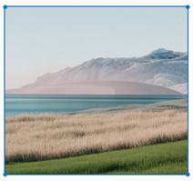

# Image Blocks in Angular Block Editor

The Block Editor supports the [Image](https://ej2.syncfusion.com/angular/documentation/api/blockeditor/blocktype) block for adding visual content. This page covers pre-configuring an `Image` block, configuring upload behavior at the editor level, server-side save handlers, and resizing.

## Adding an image block

You can use the `Image` block to display an image inside your editor.

### Configure image block

You can render an `Image` block by setting the [blockType](https://ej2.syncfusion.com/angular/documentation/api/blockeditor/blockmodel#blocktype) property to `Image` in the block model. The block's [properties](https://ej2.syncfusion.com/angular/documentation/api/blockeditor/blockmodel#properties) configure the image source and display dimensions for that specific block. Upload behavior (file size limit, allowed types, save format, server endpoint) is configured globally on the editor through `imageBlockSettings`, described below.

#### Global image settings

You can configure global settings for image blocks using the [imageBlockSettings](https://ej2.syncfusion.com/angular/documentation/api/blockeditor#imageblocksettings) property on the Block Editor component. This ensures consistent behavior for image uploads, resizing, and display.

The `imageBlockSettings` property supports the following options:

| Property | Description | Default Value |
|----------|-------------|---------------|
| [saveUrl](https://ej2.syncfusion.com/angular/documentation/api/blockeditor/imageblocksettings#saveurl) | Specifies the server endpoint URL for uploading images. If empty, server upload functionality is disabled. | `''` |
| [maxFileSize](https://ej2.syncfusion.com/angular/documentation/api/blockeditor/imageblocksettings#maxfilesize) | Specifies the maximum file size allowed for image uploads in bytes. Files exceeding this size are rejected during validation. | `30000000` |
| [path](https://ej2.syncfusion.com/angular/documentation/api/blockeditor/imageblocksettings#path) | Specifies the base path for storing and displaying images on the server. This path is appended to the server URL for image storage organization. | `''` |
| [saveFormat](https://ej2.syncfusion.com/angular/documentation/api/blockeditor/imageblocksettings#saveformat) | Specifies the format in which the image is saved. Accepts `'Blob'` (uploaded to the server) or `'Base64'` (embedded inline). | `'Blob'` |
| [allowedTypes](https://ej2.syncfusion.com/angular/documentation/api/blockeditor/imageblocksettings#allowedtypes) | Specifies the allowed image file extensions that can be uploaded. | `['.jpg', '.jpeg', '.png']` |
| [width](https://ej2.syncfusion.com/angular/documentation/api/blockeditor/imageblocksettings#width) | Default display width of the image. Can be defined in pixels or as a percentage. | `'auto'` |
| [height](https://ej2.syncfusion.com/angular/documentation/api/blockeditor/imageblocksettings#height) | Default display height of the image. Can be defined in pixels or as a percentage. | `'auto'` |
| [enableResize](https://ej2.syncfusion.com/angular/documentation/api/blockeditor/imageblocksettings#enableresize) | Specifies whether resizing the image is enabled. | `true` |
| [minWidth](https://ej2.syncfusion.com/angular/documentation/api/blockeditor/imageblocksettings#minwidth) | Minimum width allowed when resizing, in pixels or as a string unit. | `''` |
| [maxWidth](https://ej2.syncfusion.com/angular/documentation/api/blockeditor/imageblocksettings#maxwidth) | Maximum width allowed when resizing, in pixels or as a string unit. | `''` |
| [minHeight](https://ej2.syncfusion.com/angular/documentation/api/blockeditor/imageblocksettings#minheight) | Minimum height allowed when resizing, in pixels or as a string unit. | `''` |
| [maxHeight](https://ej2.syncfusion.com/angular/documentation/api/blockeditor/imageblocksettings#maxheight) | Maximum height allowed when resizing, in pixels or as a string unit. | `''` |

#### Maximum file size restriction

You can restrict the image uploaded from the local machine when the uploaded image file size is greater than the allowed size by using the [maxFileSize](https://ej2.syncfusion.com/angular/documentation/api/blockeditor/imageblocksettings#maxfilesize) property. By default, the maximum file size is 30000000 bytes. You can configure this size as follows.

```ts

    imageBlockSettings: {
      maxFileSize: 10000000
    }

```

#### Configuring allowed image types

You can allow the specific images alone to be uploaded using the the allowedTypes property. By default, the Block Editor allows the JPG, JPEG, and PNG formats. You can configure this formats as follows.

```ts

    imageBlockSettings: {
      allowedTypes: ['.jpg', '.jpeg', '.png']
    }

```

#### Configure Image Block Properties

The `Image` block [properties](https://ej2.syncfusion.com/angular/documentation/api/blockeditor/blockmodel#properties) property supports the following options:

| Property | Description | Default Value |
|----------|-------------|---------------|
| src | Specifies the image path. | `''` |
| width | Specifies the display width of the image. | `''` |
| height | Specifies the display height of the image. | `''` |
| altText | Specifies the alternative text to display when the image cannot be loaded. | `''` |

### Block type and properties

The following example demonstrates how to pre-configure an `Image` block in the editor. Unlike text-based blocks, an `Image` block does not use a `content` array — its source and dimensions are stored entirely in `properties`.

```typescript
// Adding an Image block
{
    blockType: 'Image',
    properties: {
        src: '',
        width: '200px',
        height: '100px',
        altText: 'Sample image'
    }
}
```

This sample demonstrates the configuration of the `Image` block in the Block Editor.
















## Uploading images from local machine

When the editor's `imageBlockSettings` is configured, focus an empty block and use the `+` menu to insert an `Image` block. A popup opens with a **Upload** tab where you can browse and select an image from your local machine. The selected file is then processed according to the `imageBlockSettings.saveFormat` and `imageBlockSettings.saveUrl` (see next section).

## Saving images to server

Upload the selected image to a specified destination using the controller action specified in [imageBlockSettings.saveUrl](https://ej2.syncfusion.com/angular/documentation/api/blockeditor/imageblocksettings#saveurl). Ensure to map this method name appropriately and provide the required destination path through the [imageBlockSettings.path](https://ej2.syncfusion.com/angular/documentation/api/blockeditor/imageblocksettings#path) property.

Set the [imageBlockSettings.saveFormat](https://ej2.syncfusion.com/angular/documentation/api/blockeditor/imageblocksettings#saveformat) property to determine how the image is saved. By default it is `'Blob'` (uploaded to the server); set it to `'Base64'` to embed the image inline in the document. Choose the format that aligns with your application's requirements.














```csharp

// Note: IHostingEnvironment was deprecated in ASP.NET Core 3.0.
// In modern projects, inject IWebHostEnvironment instead:
//   private readonly IWebHostEnvironment _env;
//   public HomeController(IWebHostEnvironment env) { _env = env; }
public class HomeController : Controller
    {
        private IHostingEnvironment hostingEnv;

        public HomeController(IHostingEnvironment env)
        {
            hostingEnv = env;
        }

        public IActionResult Index()
        {
            return View();
        }

        [AcceptVerbs("Post")]
        public void SaveImage(IList<IFormFile> UploadFiles)
        {
            try
            {
                foreach (IFormFile file in UploadFiles)
                {
                    if (UploadFiles != null)
                    {
                        string filename = ContentDispositionHeaderValue.Parse(file.ContentDisposition).FileName.Trim('"');
                        filename = hostingEnv.WebRootPath + "\\Uploads" + $@"\{filename}";

                        // Create a new directory, if it does not exists
                        if (!Directory.Exists(hostingEnv.WebRootPath + "\\Uploads"))
                        {
                            Directory.CreateDirectory(hostingEnv.WebRootPath + "\\Uploads");
                        }

                        if (!System.IO.File.Exists(filename))
                        {
                            using (FileStream fs = System.IO.File.Create(filename))
                            {
                                file.CopyTo(fs);
                                fs.Flush();
                            }
                            Response.StatusCode = 200;
                        }
                    }
                }
            }
            catch (Exception)
            {
                Response.StatusCode = 204;
            }
        }

        [ResponseCache(Duration = 0, Location = ResponseCacheLocation.None, NoStore = true)]
        public IActionResult Error()
        {
            return View(new ErrorViewModel { RequestId = Activity.Current?.Id ?? HttpContext.TraceIdentifier });
        }
    }

```

### Secure image upload with authentication

You can attach extra data (for example, an authorization token) to an image upload by using the [fileUploading](https://ej2.syncfusion.com/angular/documentation/api/blockeditor#fileuploading) event on the Block Editor. The event's `currentRequest` argument exposes the underlying XMLHttpRequest, so you can set custom headers (such as `Authorization`) before the request is sent. On the server side, you can read those headers from the form collection of the current request, as in the `SaveFiles` controller method shown below.














```csharp

public void SaveFiles(IList<IFormFile> UploadFiles)
{
    string currentPath = Request.Form["Authorization"].ToString();
}

```

## Inserting images from web URLs

To insert an image from an online source, render the `Image` block. Switch to the `Embed Link` tab containing an input field where you can provide the image URL from the web to insert the image.

## Image resizing

The Block Editor has built-in image-resizing support. Resize handles appear at each corner of an image when it is focused, and the user can drag any handle with the mouse or touch to resize the image. The resize calculation preserves the image's aspect ratio by default. You can disable resizing globally with `imageBlockSettings.enableResize = false`, and you can constrain the resize range with `minWidth`/`maxWidth`/`minHeight`/`maxHeight` (see the [Global image settings](#global-image-settings) table above).

