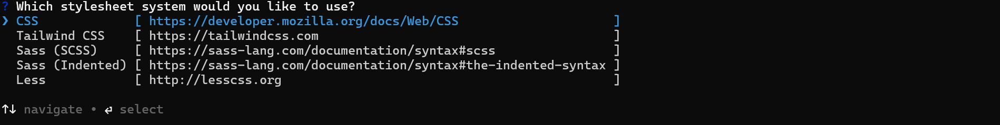
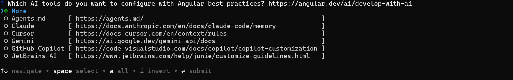
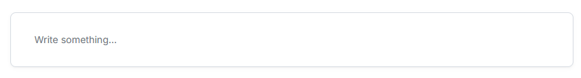

# Getting Started with Angular Headless Editor

The Syncfusion Angular Headless Editor component is a powerful text editing solution that provides an framework-integrated way to create and manage editable content in Angular applications.

> **Ready to streamline your Syncfusion<sup style="font-size:70%">&reg;</sup> Angular development?** Discover the full potential of Syncfusion<sup style="font-size:70%">&reg;</sup> Angular components with Syncfusion<sup style="font-size:70%">&reg;</sup> AI Coding Assistant. Effortlessly integrate, configure, and enhance your projects with intelligent, context-aware code suggestions, streamlined setups, and real-time insights—all seamlessly integrated into your preferred AI-powered IDEs like VS Code, Cursor, Syncfusion<sup style="font-size:70%">&reg;</sup> CodeStudio and more. [Explore Syncfusion<sup style="font-size:70%">&reg;</sup> AI Coding Assistant](https://ej2.syncfusion.com/angular/documentation/mcp-server/ai-coding-assistant/getting-started)





## Prerequisites

- [Node.js 24+](https://nodejs.org/en) (LTS recommended).
- Syncfusion CLI.

## Install the Syncfusion CLI

Install the Syncfusion CLI globally using the following command:



npm install -g @syncfusion/syncfusion-cli



## Create a new Angular application using the Syncfusion CLI

You can create an Angular application using the Syncfusion CLI. The CLI provides two ways to create a project:

### Non-interactive mode

Non-interactive mode allows you to create a project directly using a single command with the required command-line arguments.



sf new syncfusion-angular-app --framework angular --template headless-editor



In this mode, the project configuration is passed directly in the command. The above command creates an Angular application configured with the Syncfusion<sup style="font-size:70%">&reg;</sup> Headless Editor component.

### Interactive mode

Interactive mode guides you through the project creation process with step-by-step prompts.



sf



When you run the `sf` command, the CLI prompts you to select the required project configuration. To create a Angular application with the Syncfusion<sup style="font-size:70%">&reg;</sup> `Headless Editor` component, select the following options:




√ Project name? ... syncfusion-angular-app
√ Choose Framework: » Angular
√ Choose Template: » Headless Editor
√ Choose Theme: » Material3
√ Choose Style Format: » CSS
√ Would you like to integrate the Syncfusion MCP Server (AI Assistant) into this project? ... no
√ Would you like to install Syncfusion Component Skills for AI-powered development? ... no
√ Install dependencies and start app now? ... no




The above selections generate an Angular application configured with the Syncfusion<sup style="font-size:70%">&reg;</sup> `Headless Editor` component. You can choose different values for language, theme, style format, MCP setup, and skills installation based on your project requirements.

The Syncfusion<sup style="font-size:70%">&reg;</sup> CLI creates the project with a predefined template. After the project is generated, you can customize or replace the component code based on your application requirements.

## Run the project

Once the project is created, navigate to the project directory and run the following commands in your terminal.



cd syncfusion-angular-app
npm install
ng serve



The output will appear as follows:






## Prerequisites

This guide uses the Angular CLI to manage Angular applications. It requires Node `24.13.0` or higher. For more information about Angular CLI and its features, refer the [Angular CLI](https://github.com/angular/angular-cli).

N> For information about supported Angular versions and Syncfusion package compatibility, refer to the [Version Compatibility](https://ej2.syncfusion.com/angular/documentation/upgrade/version-compatibility) documentation.

## Set up the Angular environment

You can use the [Angular CLI](https://github.com/angular/angular-cli) to set up your Angular applications. To install the Angular CLI, use the following command.

```bash
npm install -g @angular/cli
```

## Create an Angular application

Create a new Angular application using the following Angular CLI command:

```bash
ng new my-app
```
This command will prompt you for a few settings for the new project, such as which stylesheet format to use.



By default, the Angular CLI creates a CSS-based application.

Then the CLI also displays an additional prompt asking whether to enable Server‑Side Rendering (SSR) and Static Site Generation (SSG), as shown below:


For this setup, when prompted for the Server-side rendering (SSR) option, choose the appropriate configuration.

Then the CLI displays another prompt related to AI tooling support, as shown below:



Any preferred option can be selected based on the development workflow or project needs.

Next, navigate to the project folder:

```bash
cd my-app
```

## Add the Syncfusion Headless Editor package

All available Essential JS 2 packages are published in the [npmjs.com](https://www.npmjs.com/~syncfusionorg) registry. Install the Headless Editor library with the following command:

```bash
npm install @syncfusion/ej2-headless-editor
```

## Add the CSS reference

Syncfusion provides multiple themes for the Headless Editor library. For a complete list of available themes, refer to the [themes packages](https://ej2.syncfusion.com/angular/documentation/appearance/overview#theme-packages).

To apply the [Material 3](https://www.npmjs.com/package/@syncfusion/ej2-material3-theme) theme, install the corresponding theme package by using the following command:

```bash
npm install @syncfusion/ej2-material3-theme
```

The installed theme package includes an `index.css` file that automatically imports all the required dependency styles. Import the following stylesheet into `src/style.css`.

```css
@import '../node_modules/@syncfusion/ej2-material3-theme/styles/headless-editor/index.css';
```

## Add the Headless Editor library

The Angular Headless Editor can be integrated by creating a `HeadlessEditor` instance in the Angular component and mounting it to a host element after the component view has been rendered.

The Angular application uses a separate `app.html` template to define the host element for the editor. The editor instance is then initialized in the component and mounted to this host element during the component lifecycle.


Update the following files in the `src/app` folder:















## Run the application

Use the following command to run the application in the browser.

```bash
ng serve --open
```

The Syncfusion<sup style="font-size:70%">&reg;</sup> Angular Headless Editor is displayed in the browser as shown below.




