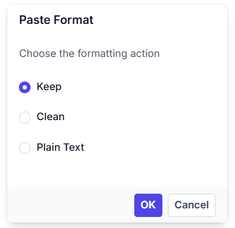

# Paste Cleanup in Angular Rich Text Editor

The Rich Text Editor simplifies the conversion of Microsoft Word content to HTML format, preserving formatting and styles. The `pasteCleanup` settings property (see [pasteCleanupSettingsModel](https://ej2.syncfusion.com/angular/documentation/api/rich-text-editor/pastecleanupsettingsmodel)) allows you to control the formatting and styles when pasting content into the editor. The following settings are available to clean up the content:

| API | Description | Type |
|:----------------:|:---------:|:---------:|
| [`prompt`](https://ej2.syncfusion.com/angular/documentation/api/rich-text-editor/pastecleanupsettingsmodel#prompt) | Displays a dialog box when content is pasted, allowing users to choose how the content should be inserted—either as plain text, with formatting, or cleaned HTML. | boolean |
| [`plainText`](https://ej2.syncfusion.com/angular/documentation/api/rich-text-editor/pastecleanupsettingsmodel#plaintext) | Pastes the content as plain text. | boolean |
| [`keepFormat`](https://ej2.syncfusion.com/angular/documentation/api/rich-text-editor/pastecleanupsettingsmodel#keepformat) | Retains the original formatting of the pasted content, including styles, fonts, and structure. | boolean |
| [`deniedTags`](https://ej2.syncfusion.com/angular/documentation/api/rich-text-editor/pastecleanupsettingsmodel#deniedtags) | Specifies a list of HTML tags to be removed from the pasted content, such as `<script>`, `<iframe>`, or `<style>`. Helps eliminate unwanted or unsafe elements.| string[] |
| [`deniedAttrs`](https://ej2.syncfusion.com/angular/documentation/api/rich-text-editor/pastecleanupsettingsmodel#deniedattrs) | Filters out the specified attributes from the pasted content. | string[] |
| [`allowedStyleProps`](https://ej2.syncfusion.com/angular/documentation/api/rich-text-editor/pastecleanupsettingsmodel#allowedStyleProps) | Specifies the list of CSS style properties allowed in the pasted content. See the [full list of allowed properties](https://ej2.syncfusion.com/angular/documentation/api/rich-text-editor/index-default#pastecleanupsettings) in the documentation. | string[] |

> Rich Text Editor features are segregated into individual feature-wise modules. To enable paste cleanup, include `PasteCleanupService` in the component's `providers` array.

## Paste options in the prompt dialog

When `prompt` is set to true, pasting the content in the editor will open a dialog box that contains three options `Keep`, `Clean`, and `Plain Text` as radio buttons:

1. `Keep`: Maintains the same format as the copied content.
2. `Clean`: Clears all style formats from the copied content.
3. `Plain Text`: Pastes the copied content as plain text without any formatting or style (including the removal of all tags).

> When `prompt` is set to `true`, the API properties [`plainText`](https://ej2.syncfusion.com/angular/documentation/api/rich-text-editor/pasteCleanupSettingsModel#plainText) and [`keepFormat`](https://ej2.syncfusion.com/angular/documentation/api/rich-text-editor/pasteCleanupSettingsModel#keepFormat) are not considered when pasting the content.

## Plain text pasting

Setting `plainText` to `true` converts the copied content to plain text by removing all HTML tags and styles. Only the plain text is pasted into the editor.

> When `plainText` is set to `true`, set `prompt` to `false`. The `keepFormat` property is not considered in this mode.

## Keep format

When `keepFormat` is set to `true`, the pasted content retains its original formatting, including styles, fonts, and structure. However, the formatting is still subject to filtering based on the `allowedStyleProps`, `deniedTags`, and `deniedAttrs` settings:

* Only the style properties listed in `allowedStyleProps` will be preserved.
* Any HTML tags listed in `deniedTags` will be removed.
* Any attributes listed in `deniedAttrs` will be stripped from the pasted content.

This ensures that while the formatting is retained, it remains clean, safe, and consistent with your application's styling rules.

> When `keepFormat` is set to `true`, set both `prompt` and `plainText` to `false`.

## Clean formatting

When `prompt`, `plainText`, and `keepFormat` are all set to `false`, the Rich Text Editor performs clean format paste cleanup. In this mode, all inline styles from the pasted content are removed, eliminating any custom or external styling and ensuring a consistent appearance within the editor.

Despite the removal of styling, essential structural HTML tags such as `
`, `<ul>`, and `<table>` are preserved. This maintains the original layout and semantic integrity of the content. However, the formatting is still subject to filtering based on the `deniedTags` and `deniedAttrs` settings:

- **`deniedTags`**: Tags listed here will still be removed from the pasted content.
- **`deniedAttrs`**: Attributes listed here will also be stripped from the pasted content.

> The `allowedStyleProps` setting only applies if `keepFormat` is set to `true`.

## Denied tags

When `deniedTags` values are set, the specified tags are removed from the pasted content. For example:

* `'a'`: removes all anchor tags.
* `'a[!href]'`: removes anchor tags without the `href` attribute.
* `'a[href, target]'`: removes anchor tags with both `href` and `target` attributes.

> This setting is ignored when `plainText` is set to `true`. It only works when either `keepFormat` is set to `true`, or when `prompt`, `plainText`, and `keepFormat` are all set to `false`, which triggers clean format behavior.

## Denied attributes

When `deniedAttrs` values are set, the specified attributes are removed from all tags in the pasted content. For example:

`'id', 'title'`: removes `id` and `title` attributes from all tags.

> This setting is ignored when `plainText` is set to `true`.  
It only works when either `keepFormat` is set to `true`, or when `prompt`, `plainText`, and `keepFormat` are all set to `false`, which triggers clean format behavior.

## Allowing specific style properties

By default, a predefined set of basic style properties is allowed when content is pasted into the Rich Text Editor.

When you configure the [`allowedStyleProps`](https://ej2.syncfusion.com/angular/documentation/api/rich-text-editor/pasteCleanupSettingsModel#allowedStyleProps) setting, only the styles that match the specified list of allowed properties are retained. All other style properties are removed from the pasted content.

You can find the full list of allowed style properties in the [official Syncfusion documentation](https://ej2.syncfusion.com/angular/documentation/api/rich-text-editor/index-default#pasteCleanupSettings).

> This setting works only when `keepFormat` is set to `true`. If `keepFormat` is `false` or `plainText` is `true`, style filtering via `allowedStyleProps` is not applied.

For example:

`allowedStyleProps: ['color', 'margin']`: this allows only the style properties `color` and `margin` in each pasted element.

In the following example, the paste cleanup related settings are explained with its module configuration










  


## Get pasted content

You can get the pasted text as HTML using the [`afterPasteCleanup`](https://ej2.syncfusion.com/angular/documentation/api/rich-text-editor/index-default#afterPasteCleanup) event.










  


## Customize pasted content

The Rich Text Editor lets you customize copied content prior to pasting it into the editor. By configuring the [`afterPasteCleanup`](https://ej2.syncfusion.com/angular/documentation/api/rich-text-editor/index-default#afterPasteCleanup) event, you can precisely control formatting and content modifications after the paste action is executed.

In the following example, the `afterPasteCleanup` event is configured to remove images from the copied content. To understand this feature better, try pasting content that includes an image into the editor.










  
