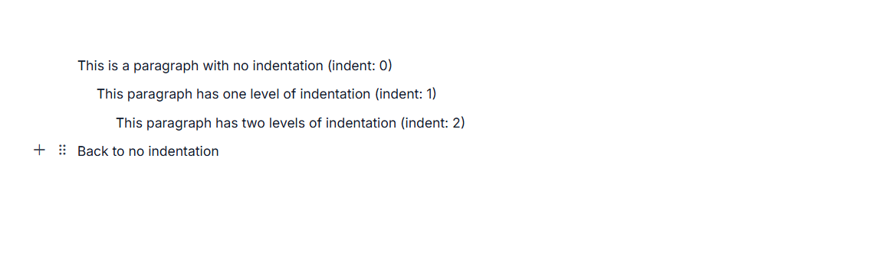
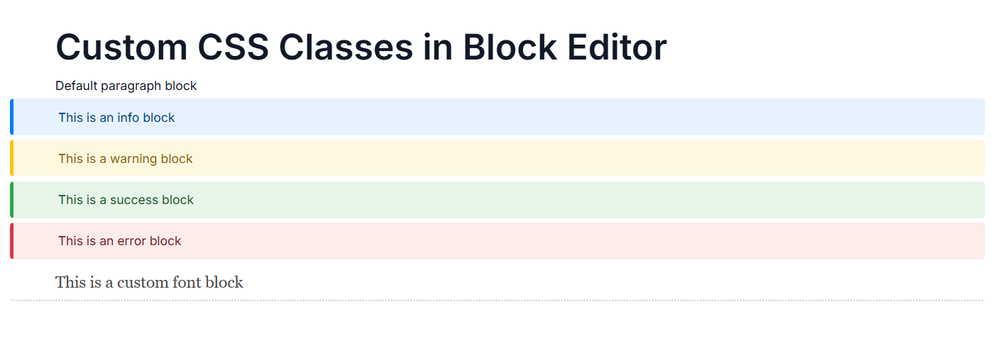
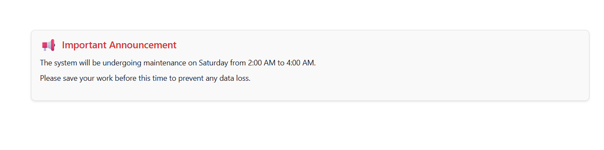

# Built-in Block Types and Configuration  in ASP.NET Core Block Editor

The Block Editor control enables you to create a block-based content editing solution using various types of blocks. The [blocks](https://help.syncfusion.com/cr/aspnetcore-js2/Syncfusion.EJ2.BlockEditor.BlockEditor.html#Syncfusion_EJ2_BlockEditor_BlockEditor_Blocks) tag helper allows you to define and manage the content structure of your editor. For initial setup, see the [Getting Started guide](https://help.syncfusion.com/rich-text-editor-sdk/asp-net-core/block-editor/getting-started).

## Blocks

Blocks are the fundamental building elements of the Block Editor. Each block represents a distinct content unit with specific properties and formatting. Common block types include:
- Text blocks (`Paragraph`, `Heading1`-`Heading4`)
- List blocks (`BulletList`, `NumberedList`, `Checklist`)
- Specialized content (`Code`, `Image`, `Quote`, `Callout`, `Table`, `Divider`)
- Collapsible blocks (`CollapsibleParagraph`, `CollapsibleHeading1`-`CollapsibleHeading4`)
- Custom (`Template`)

The Block Editor organizes content as a collection of `e-block` tag helpers, allowing for better structure and formatting options. You can configure each block with properties such as `id`, `blockType`, `content`, `indent`, and `cssClass` to create rich and structured editor content.

## Block types

The Block Editor supports multiple block types. Each block type offers different formatting and functionality options:

| Built-in Block Types                    | Description                                       |
|-----------------------------------------|---------------------------------------------------|
| Paragraph                               | Default block type for regular text content.      |
| Heading1 to Heading4                    | Different levels of headings for document structure.|
| Checklist                               | Interactive to-do lists with checkable items.     |
| BulletList                              | Unordered lists with bullet points.               |
| NumberedList                            | Ordered lists with sequential numbering.          |
| Code                                    | Formatted code blocks with syntax highlighting.   |
| Quote                                   | Styled block for quotations.                      |
| Callout                                 | Highlighted block for important information.      |
| Divider                                 | Horizontal separator line.                        |
| CollapsibleParagraph and CollapsibleHeading1-4    | Collapsible content blocks.                       |
| Image                                   | Block for displaying images.                      |
| Template                                | Predefined custom templates.                      |

> For blocks such as `Code`, `Callout`, `Table`, `Image`, and `Collapsible`, the first Backspace/Delete action applies an overlay selection to the block, and the second action removes the block content. This ensures consistent and predictable handling of block deletion across these types.

## Configure block properties

### Indent

You can specify the indentation level of individual blocks using the `indent` property on the `e-block` element. This property accepts a numeric value (0 or higher) that determines how deeply a block is nested from the left margin.

By default, the `indent` property is set to `0`.












### CSS Class

You can apply custom styling to individual blocks by adding the `cssClass` property to the `e-block` tag helper. This property accepts a string containing one or more CSS class names separated by spaces.

Define custom CSS styles in your stylesheet and apply them to blocks:

```css
/* Custom styles for block classes */
.highlight-block {
    background-color: #fff3cd;
    padding: 10px;
    border-left: 4px solid #ff9800;
}

.large-text {
    font-size: 18px;
    font-weight: bold;
}
```

The Block Editor allows you to use custom templates for specialized content using the `template` block type. Templates define custom HTML structures and can include complex layouts with interactive elements. Templates are useful for creating custom content types beyond the built-in block type
Custom CSS classes allow you to define specialized styling for specific blocks in your editor.












## Configure templates

The Block Editor allows you to use custom templates for specialized content using the `template` property. Templates can be defined as strings, functions, or HTML elements.











