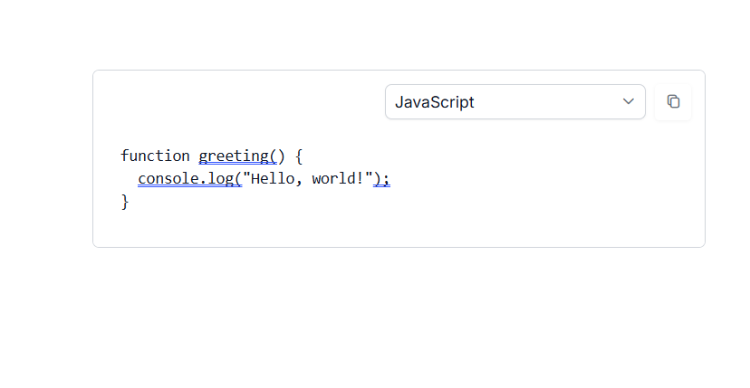

# Code Blocks in ASP.NET Core Block Editor

You can render code blocks by setting the `blockType` property to `Code`. Use the `properties` property on the block model to configure the default language for an individual code block. The default language is `plaintext`.

## Global Code Settings

You can configure global settings for code blocks using the [CodeBlockSettings](https://help.syncfusion.com/cr/aspnetcore-js2/Syncfusion.EJ2.BlockEditor.BlockEditor.html#Syncfusion_EJ2_BlockEditor_BlockEditor_CodeBlockSettings) property in the Block Editor root configuration. This ensures consistent behavior for syntax highlighting and language options across all code blocks.

The [CodeBlockSettings](https://help.syncfusion.com/cr/aspnetcore-js2/Syncfusion.EJ2.BlockEditor.BlockEditor.html#Syncfusion_EJ2_BlockEditor_BlockEditor_CodeBlockSettings) property supports the following options:

| Property | Description | Default Value |
|----------|-------------|---------------|
| `languages` | Specifies the array of language options for syntax highlighting. | [] |
| `defaultLanguage`| Defines the default language to use for syntax highlighting. | 'plaintext' |

Each language object in the `languages` array should have:
- `language`: The language value used for syntax highlighting
- `label`: The display name shown in the language selector

## Configure code properties

For individual code blocks, you can configure the default language using the `properties` property in the block model.

The property supports the following options:

| Property | Description | Default Value |
|----------|-------------|---------------|
| `language` | The default language to use for syntax highlighting | `''` |

The example below illustrates how to render the code block in the Block Editor.










