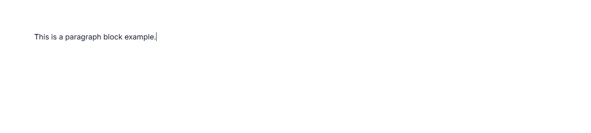
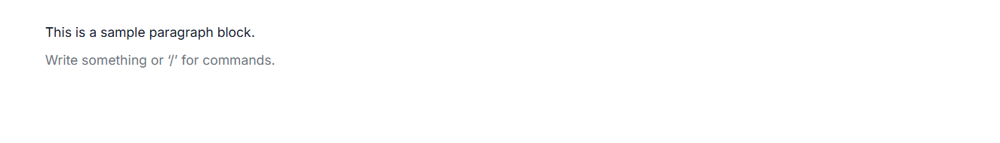
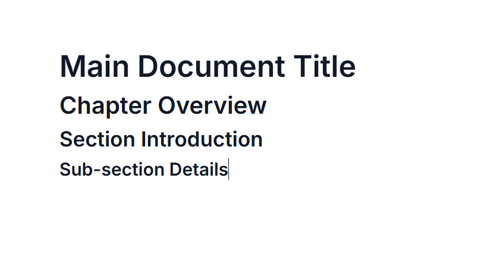
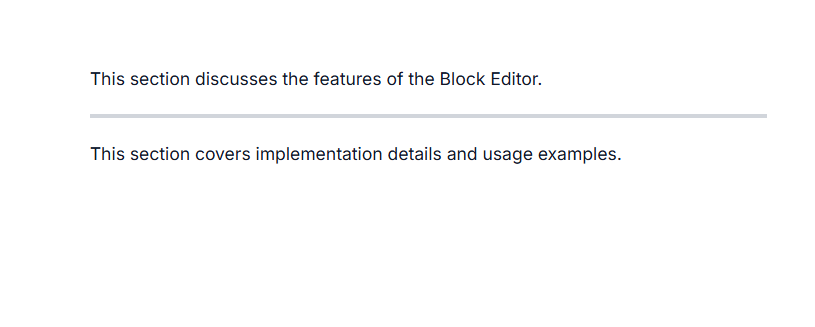

# Text Block Types in ASP.NET Core Block Editor

Typography blocks are essential for organizing and presenting text-based content in your documents. The Block Editor component supports various structural blocks—such as Paragraph, Heading, Collapsible Block, Divider, Quote, and Callout to help you format and structure content effectively.

## Configure paragraph block

You can render Paragraph blocks by setting the `blockType` property as `Paragraph`. Paragraph blocks are the most common type, used for regular text content. They provide standard text formatting options and serve as the default block type.

### BlockType  

```csharp
// Adding paragraph block
new BlockModel
{
    blockType = "Paragraph",
    content = new List<object>
    {
        new { contentType = "Text", content = "This is a paragraph block example." }
    }
}
```

The below sample demonstrates the configuration of paragraph block in the Block Editor.












### Configure placeholder

You can configure placeholder text for block using the `placeholder` in the `properties` property. This text appears when the block is empty. The default placeholder for the paragraph block is `Write something or ‘/’ for commands.`.

### Block type & properties

```csharp
// Adding placeholder
new BlockModel
{
    blockType = "Paragraph",
    properties = new { placeholder = "Start typing ..." },
    content = new List<object>()
}
```

The below sample demonstrates the configuration of placeholder in the Block Editor for the paragraph block.












## Configure heading block

You can render Heading blocks by setting the `blockType` property as `Heading`. Heading blocks are used to create document titles and section headers of varying importance. These blocks help structure your content hierarchically, making it easier to read and navigate.

### Configure levels

You can configure the heading blocks using the property `level` in the `properties` property.
The heading levels range from `level: 1` (title) to `level: 4` (subsection). Level values must be between 1 and 4.

### Block type & properties

```csharp
// Adding heading block (levels range from 1 to 4)
new BlockModel
{
    blockType = "Heading",
    content = new List<object>
    {
        new { contentType = "Text", content = "Section Heading" }
    },
     // levels range from 1 to 4
    properties = new { level = 4 }
}
```

The below sample demonstrates the configuration of heading block in the Block Editor.












### Configure placeholder

You can configure placeholder text for block using the `placeholder` in the `properties` property. This text appears when the block is empty. The default placeholder for heading block is `Heading{level}`.

### Block type & properties

```csharp
// Adding placeholder for heading
new BlockModel
{
    blockType = "Heading",
    properties = new { level = 2, placeholder = "Enter heading..." },
    content = new List<object>()
}
```

## Configure divider block

Divider blocks insert horizontal lines that separate different sections of content. You can render Divider blocks by setting the `blockType` property as `Divider`.

### BlockType 

```csharp
// Adding divider block
new BlockModel
{
    blockType = "Divider"
}
```

The below sample demonstrates the configuration of divider block in the Block Editor.











