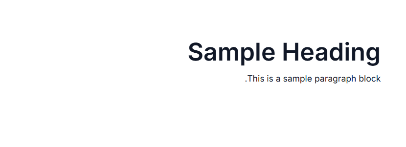

# Globalization in ASP.NET Core Block Editor

The Block Editor control supports localization, right-to-left (RTL) text direction, and culture-specific formatting to provide a global user experience.

## Localization

The Block Editor can be localized to any culture by defining the text in the corresponding culture. The default locale is `en` (English). The following table shows the default text of the Block Editor in the `en` culture, which can be overridden for other locales.

|KEY|Text|
|----|----|
|`paragraph`|Write something or '/' for commands.|
|`heading1`|Heading 1|
|`heading2`|Heading 2|
|`heading3`|Heading 3|
|`heading4`|Heading 4|
|`collapsibleParagraph`|Collapsible Paragraph|
|`collapsibleHeading1`|Collapsible Heading 1|
|`collapsibleHeading2`|Collapsible Heading 2|
|`collapsibleHeading3`|Collapsible Heading 3|
|`collapsibleHeading4`|Collapsible Heading 4|
|`bulletList`|Add item|
|`numberedList`|Add item|
|`checklist`|Todo|
|`callout`|Write a callout|
|`addIconTooltip`|Click to insert below|
|`dragIconTooltipActionMenu`|Click to open|
|`dragIconTooltip`|(Hold to drag)|
|`insertLink`|Insert Link|
|`linkText`|Text|
|`linkTextPlaceholder`|Link text|
|`linkUrl`|URL|
|`linkUrlPlaceholder`|https://example.com|
|`linkTitle`|Title|
|`linkTitlePlaceholder`|Link title|
|`linkOpenInNewWindow`|Open in new window|
|`linkInsert`|Insert|
|`linkRemove`|Remove|
|`linkCancel`|Cancel|
|`codeCopyTooltip`|Copy code|

The below example shows adding the German culture locale(`de-DE`)










## RTL

RTL switches the text direction and layout of the Block Editor control from right to left by setting the [EnableRtl](https://help.syncfusion.com/cr/aspnetcore-js2/Syncfusion.EJ2.BlockEditor.BlockEditor.html#Syncfusion_EJ2_BlockEditor_BlockEditor_EnableRtl) property to `true`. When enabled, icons, layouts, and text alignment are automatically mirrored to support RTL languages such as Arabic, Hebrew, and Persian.










