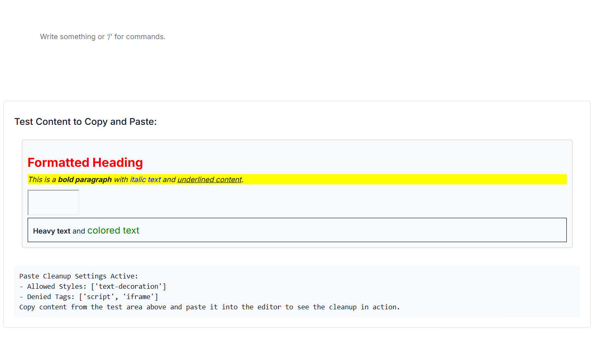
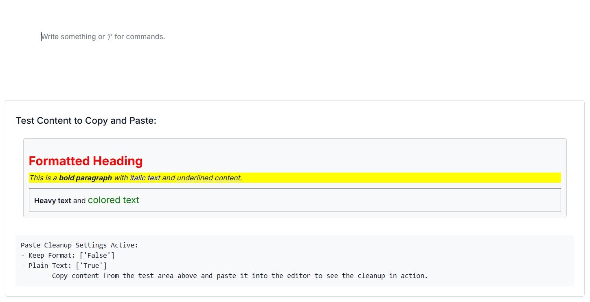

# Paste Cleanup in ASP.NET Core Block Editor

The Block Editor provides paste-cleanup features that maintain content consistency and strip unwanted formatting, scripts, or elements from external sources such as web pages or word processors.

You can configure the paste settings using the [e-blockeditor-pastesettings](https://help.syncfusion.com/cr/aspnetcore-js2/Syncfusion.EJ2.BlockEditor.PasteCleanupSettings.html) tag helper in the Block Editor control. This property allows you to define various options to control how content is pasted into the editor.

## Configuring allowed styles

The [AllowedStyles](https://help.syncfusion.com/cr/aspnetcore-js2/Syncfusion.EJ2.BlockEditor.PasteCleanupSettings.html#Syncfusion_EJ2_BlockEditor_PasteCleanupSettings_AllowedStyles) property in the [`PasteCleanupSettings`](https://help.syncfusion.com/cr/aspnetcore-js2/Syncfusion.EJ2.BlockEditor.PasteCleanupSettings.html) model defines which CSS styles are permitted when content is pasted. The editor strips any style not in this list, preserving only the desired visual attributes.

By default, the following styles are allowed:

['font-weight', 'font-style', 'text-decoration', 'text-transform'].

In the below example, only `font-weight` and `font-style` styles are retained from the pasted content. All other inline styles are removed.

```cshtml

@{
    var allowedStyles = new string[] { "font-weight", "font-style" };
}
<div id='blockeditor-container'>
    <ejs-blockeditor id="block-editor">
        <e-blockeditor-pastesettings allowedStyles="@allowedStyles"></e-blockeditor-pastesettings>
    </ejs-blockeditor>
</div>

```

## Setting denied tags

The [DeniedTags](https://help.syncfusion.com/cr/aspnetcore-js2/Syncfusion.EJ2.BlockEditor.PasteCleanupSettings.html#Syncfusion_EJ2_BlockEditor_PasteCleanupSettings_DeniedTags) property in [`PasteCleanupSettings`](https://help.syncfusion.com/cr/aspnetcore-js2/Syncfusion.EJ2.BlockEditor.PasteCleanupSettings.html) specifies HTML tags that are completely removed from pasted content. This is useful for stripping `script`, `iframe`, or other elements you don't want in the editor. By default, the `DeniedTags` property is an empty array — no tags are removed unless configured.

In the below example, any `<script>` or `<iframe>` tags found in the pasted content will be removed, preventing unwanted behavior or styling issues.

```cshtml

@{
    var deniedTags = new string[] { "script", "iframe" };
}
<div id='blockeditor-container'>
    <ejs-blockeditor id="block-editor">
        <e-blockeditor-pastesettings deniedTags="@deniedTags"></e-blockeditor-pastesettings>
    </ejs-blockeditor>
</div>

```

Below example demonstrates the usage of paste settings that allows only specific styles and also removes the specific tags from the pasted content.












## Disable Keep format

By default, the editor keeps the formatting of pasted content (e.g., bold, italics, links). You can disable this by setting the [KeepFormat](https://help.syncfusion.com/cr/aspnetcore-js2/Syncfusion.EJ2.BlockEditor.PasteCleanupSettings.html#Syncfusion_EJ2_BlockEditor_PasteCleanupSettings_KeepFormat) property to `false` in [`PasteCleanupSettings`](https://help.syncfusion.com/cr/aspnetcore-js2/Syncfusion.EJ2.BlockEditor.PasteCleanupSettings.html).

```cshtml

<div id='blockeditor-container'>
    <ejs-blockeditor id="block-editor">
        <e-blockeditor-pastesettings keepFormat="false"></e-blockeditor-pastesettings>
    </ejs-blockeditor>
</div>

```

## Allowing plain text

To paste content purely as plain text, stripping all HTML tags and inline styles, you can set the [PlainText](https://help.syncfusion.com/cr/aspnetcore-js2/Syncfusion.EJ2.BlockEditor.PasteCleanupSettings.html#Syncfusion_EJ2_BlockEditor_PasteCleanupSettings_PlainText) property to `true` in [`PasteCleanupSettings`](https://help.syncfusion.com/cr/aspnetcore-js2/Syncfusion.EJ2.BlockEditor.PasteCleanupSettings.html). This ensures that only the raw textual content is inserted into the editor, making it ideal for maintaining strict content consistency. By default, the [PlainText](https://help.syncfusion.com/cr/aspnetcore-js2/Syncfusion.EJ2.BlockEditor.PasteCleanupSettings.html#Syncfusion_EJ2_BlockEditor_PasteCleanupSettings_PlainText) property is set to `false`.

```cshtml

<div id='blockeditor-container'>
    <ejs-blockeditor id="block-editor">
        <e-blockeditor-pastesettings plainText="true"></e-blockeditor-pastesettings>
    </ejs-blockeditor>
</div>

```

Below example demonstrates the usage of paste settings that disables the keep format and allows plain text.












### Events

The following events are available when pasting content into the editor.

|Name|Args|Description|
|---|---|---|
|`beforePasteCleanup`|BeforePasteCleanupEventArgs|Triggers before the content is pasted into the editor.|
|`afterPasteCleanup`|AfterPasteCleanupEventArgs|Triggers after the content is pasted into the editor.|

Below snippet demonstrates how to configure above events in the editor.

```cshtml

<div id='blockeditor-container'>
    <ejs-blockeditor id="block-editor" beforePasteCleanup="beforePaste" afterPasteCleanup="afterPaste"></ejs-blockeditor>
</div>

<script>
    function afterPaste(args) {
        // Process pasted content or update UI
    }
    function beforePaste(args) {
        // You may cancel paste if content contains restricted elements
    }
</script>

```
