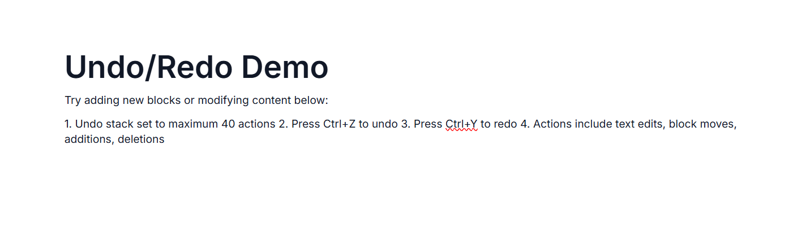

# Undo and Redo in ASP.NET Core Block Editor

Undo/redo lets users revert and reapply changes made to the editor content, providing a safety net for edits.

The Block Editor tracks the following types of actions in the undo/redo stack:
- Text content changes (typing, deletion)
- Block additions, deletions, and duplication
- Block movements and reordering (via drag-and-drop or shortcuts)
- Inline formatting changes (bold, italic, underline, color)
- Block transformations (paragraph to heading, etc.)

## Keyboard shortcuts

| Action | Windows | Mac | Description |
|--------|---------|-----|-------------|
| Undo | <kbd>Ctrl</kbd> + <kbd>Z</kbd> | <kbd>⌘</kbd> + <kbd>Z</kbd> | Reverts the last action. |
| Redo | <kbd>Ctrl</kbd> + <kbd>Y</kbd> | <kbd>⌘</kbd> + <kbd>Y</kbd> | Reapplies the last undone action. |

## Configuring Undo/Redo stack

Block Editor allows up to `30` Undo/Redo actions by default. You can modify the number of undo/redo steps using the [undoRedoStack](https://help.syncfusion.com/cr/aspnetcore-js2/Syncfusion.EJ2.BlockEditor.BlockEditor.html#Syncfusion_EJ2_BlockEditor_BlockEditor_UndoRedoStack) property.










