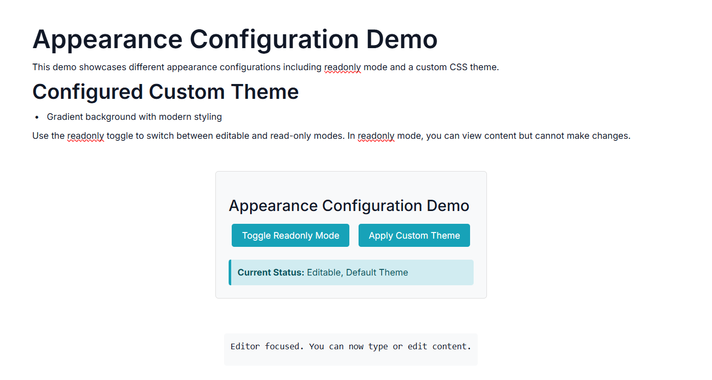

# Style and Appearance in ASP.NET MVC Block Editor

The Block Editor control provides various appearance customization options to match your application's design requirements. These properties allow you to control the visual styling, layout, and overall look and feel of the editor.

## Setting width and height

You can specify the width and height for the Block Editor control using the [Width](https://help.syncfusion.com/cr/aspnetmvc-js2/Syncfusion.EJ2.BlockEditor.BlockEditor.html#Syncfusion_EJ2_BlockEditor_BlockEditor_Width) and [Height](https://help.syncfusion.com/cr/aspnetmvc-js2/Syncfusion.EJ2.BlockEditor.BlockEditor.html#Syncfusion_EJ2_BlockEditor_BlockEditor_Height) properties.

```cshtml

<div id='blockeditor-container'>
    @Html.EJS().BlockEditor("block-editor").Width("100%").Height("80vh").Render()
</div>

// Or with specific pixel values
<div id='blockeditor-container'>
    @Html.EJS().BlockEditor("block-editor").Width("800px").Height("500px").Render()
</div>

```

## Setting readonly mode

You can utilize the [ReadOnly](https://help.syncfusion.com/cr/aspnetmvc-js2/Syncfusion.EJ2.BlockEditor.BlockEditor.html#Syncfusion_EJ2_BlockEditor_BlockEditor_ReadOnly) property to control whether the editor is in read-only mode. When set to `true`, users cannot edit the content but can still view it.

```cshtml

<div id='blockeditor-container'>
    @Html.EJS().BlockEditor("block-editor").ReadOnly(true).Render()
</div>

```

## Customization using CSS Class

You can use the [CssClass](https://help.syncfusion.com/cr/aspnetmvc-js2/Syncfusion.EJ2.BlockEditor.BlockEditor.html#Syncfusion_EJ2_BlockEditor_BlockEditor_CssClass) property to customize the appearance of the Block Editor control.

```cshtml

<div id='blockeditor-container'>
    @Html.EJS().BlockEditor("block-editor").CssClass("custom-editor-theme").Width("600px").Height("400px").Render()
</div>

```











