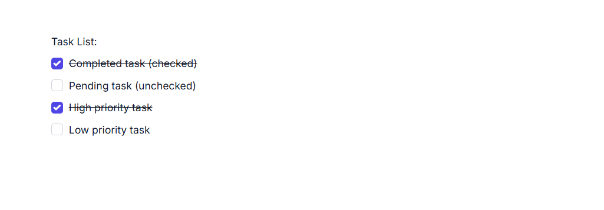
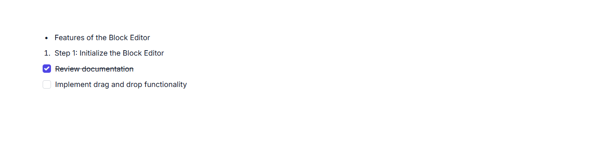

# List Blocks in ASP.NET MVC Block Editor

List blocks in the BlockEditor component are used to organize content into structured lists. You can render List blocks by setting the `blockType` property as `BulletList`, `NumberedList`, or `Checklist`. Bullet lists and numbered lists are ideal for unordered and ordered items, respectively, while checklist blocks enable interactive to-do lists with checkable items.

## Configure bullet list 

You can render Bullet List block by setting the `blockType` property as `BulletList`. This block type is used for unordered lists.

### BlockType

```csharp
// Adding bulletlist block
{
    blockType = "BulletList",
    content = new List<object>()
    {
        new
        {
            contentType = "Text",
            content = "your content"
        }
    }
}
```

### Configure placeholder

You can configure placeholder text for a block using the `placeholder` property in the `properties` property. This text appears when the block is empty. The default placeholder for a bullet list is `Add item`.

```csharp
// Adding placeholder value
{
    blockType = "BulletList",
    properties = new { placeholder = "Add item" }
}
```

## Configure numbered list

You can render Numbered List block by setting the `blockType` property as `NumberedList`. This block type is used for ordered lists.

### BlockType

```csharp
// Adding numberedlist block
{
    blockType = "NumberedList",
    content = new List<object>()
    {
        new
        {
            contentType = "Text",
            content = "your content"
        }
    }
}
```

### Configure placeholder

You can configure placeholder text for a block using the `placeholder` property in the `properties` property. This text appears when the block is empty. The default placeholder for a numbered list is `Add item`.

```csharp
// Adding placeholder value
{
    blockType = "NumberedList",
    properties = new { placeholder = "Add item" }
}
```

## Configure checklist

You can render Checklist block by setting the `blockType` property as `Checklist`. This block type is used for creating interactive to-do lists.

### BlockType

```csharp
// Adding checklist block
{
    blockType = "Checklist",
    content = new List<object>()
    {
        new
        {
            contentType = "Text",
            content = "your content"
        }
    }
}
```

### Configure checked state

For blocks that support selection states such as `Checklist`, you can configure the checked state using the `properties` property with `isChecked`.

By default, the `isChecked` property is set to `false`.












### Configure placeholder

You can configure placeholder text for a block using the `placeholder` property in the `properties` property. This text appears when the block is empty. The default placeholder for a checklist is `Todo`.

```csharp
// Adding placeholder value
{
    blockType = "Checklist",
    properties = new { placeholder = "Todo" }
}
```

## Configure list blocks

The following example illustrates how to render the different types of list blocks in the Block Editor.











