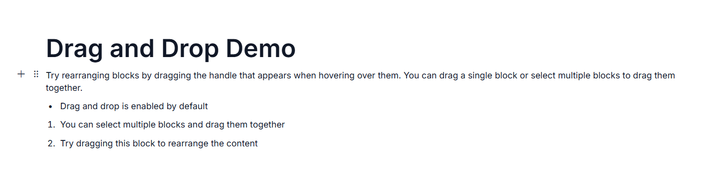

# Drag and Drop in ASP.NET MVC Block Editor

The drag and drop feature in Block Editor allows users to easily rearrange blocks within the editor by dragging them to different positions.

## Enable Drag and Drop

You can control drag-and-drop operations within the Block Editor using the [EnableDragAndDrop](https://help.syncfusion.com/cr/aspnetmvc-js2/Syncfusion.EJ2.BlockEditor.BlockEditor.html#Syncfusion_EJ2_BlockEditor_BlockEditor_EnableDragAndDrop) property. By default, this property is set to `true`, so drag and drop is enabled out of the box. Set it to `false` to disable the feature.

## Dragging blocks

When drag and drop is enabled, users can rearrange blocks in the following ways.

The Block Editor supports both single and multiple block dragging. Users can drag individual blocks or select multiple blocks and drag them together to a new position.

- **Single block dragging**: For a single block, users can hover over a block to reveal the drag handle, then click and drag to move it to a new position.

- **Multiple block dragging**: For multiple blocks, users first select the blocks they want to move. Once selected, users can drag the entire group to a new position.

During the drag operation, the editor provides visual cues to indicate where the blocks will be positioned when dropped. This helps users precisely place blocks where they want them.

## Drag-and-drop events

The Block Editor exposes the following events that you can use to react to drag-and-drop interactions:

| Event | Description |
|---|---|
| `BlockDragStart` | Triggered when the drag operation for a block starts. |
| `BlockDragging` | Triggered while a block is being dragged. |
| `BlockDropped` | Triggered when a block is dropped after a drag operation. |

Refer to the [Events](events.md) doc for callback signatures and example wiring.

The following example demonstrates how to enable drag and drop in the Block Editor:










