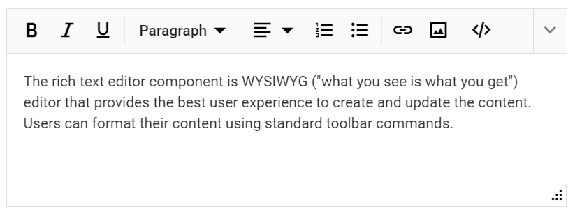

# Resizable Editor in ASP.NET MVC Rich Text Editor

The resizable editor feature allows dynamic resizing of the editor. Enable or disable this feature using the [EnableResize](https://help.syncfusion.com/cr/aspnetmvc-js2/syncfusion.ej2.richtexteditor.richtexteditor.html#Syncfusion_EJ2_RichTextEditor_RichTextEditor_EnableResize) property of the Rich Text Editor. When `EnableResize` is set to `true`, a grip appears at the bottom-right corner for diagonal resizing.

The following sample demonstrates the resizable feature.


























## Setting Editor Resize Limits

To restrict the resizable area of the Rich Text Editor, set the `min-width`, `max-width`, `min-height`, and `max-height` CSS properties for the component's wrapper element.

By default, the control resizes up to the current viewport size. Apply these styles using the `e-richtexteditor` CSS class on the component's wrapper.

```css
.e-richtexteditor {
    max-width: 880px;
    min-width: 250px;
    min-height: 250px;
    max-height: 400px;
}
```
























## See Also

* [Working with IFrame Editing Mode](./iframe)
* [Using the Markdown Editor](../../markdown-editor/getting-started.md)