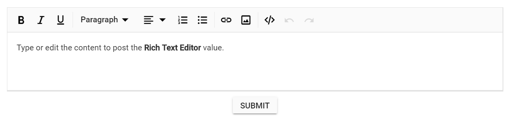

# Render RichTextEditorFor in ASP.NET MVC Rich Text Editor

The RichTextEditorFor control can be rendered by passing values from the controller. The formatted Rich Text Editor value is retrieved when submitting the form using the post method.

In the following sample, the RichTextEditorFor control is rendered.
























The output is shown below.

