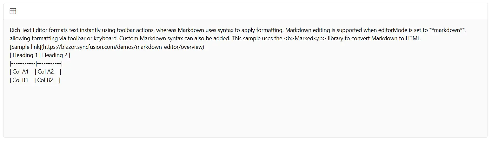

# Insert Tables in Blazor Markdown Editor

The Blazor Markdown Editor provides built-in support for inserting tables, allowing users to create and customize tables effortlessly within the editor.

## Steps to Enable Table Insertion 

To enable the table insertion feature:

1. Add the `CreateTable` option to the toolbar items.
2. Click the [Table](https://help.syncfusion.com/cr/blazor/Syncfusion.Blazor.RichTextEditor.RichTextEditorTableSettings.html#properties) icon in the toolbar.
3. Select the desired table configuration and insert it into the editor.

### Default Table Structure

When a table is inserted, it includes:

* 2 rows and 2 columns
* A table header row

This default layout allows users to begin formatting and adding content immediately.

The following example demonstrates how to enable table insertion in the Blazor Markdown Editor.









