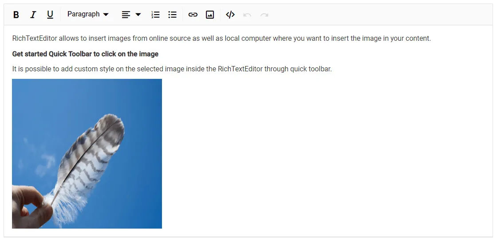
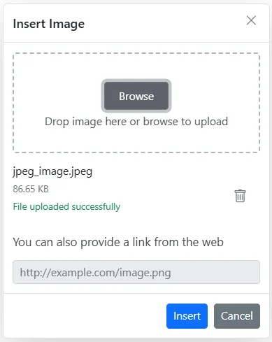
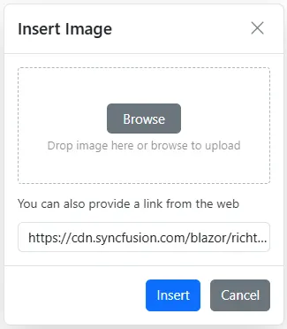
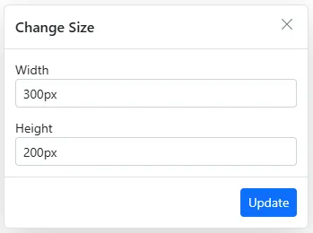
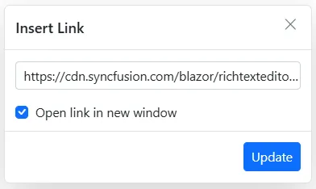
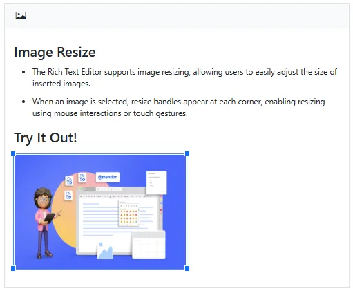

# Images in Blazor Rich Text Editor

The Rich Text Editor allows you to insert images from online sources and from the local computer where you want to insert the image in your content. For inserting an image into the Rich Text Editor, the following list of options has been provided in the [RichTextEditorImageSettings](https://help.syncfusion.com/cr/blazor/Syncfusion.Blazor.RichTextEditor.RichTextEditorImageSettings.html).


| Options | Description |
|----------------|---------|
| [AllowedTypes](https://help.syncfusion.com/cr/blazor/Syncfusion.Blazor.RichTextEditor.RichTextEditorImageSettings.html#Syncfusion_Blazor_RichTextEditor_RichTextEditorImageSettings_AllowedTypes) | Specifies the extensions of the image types allowed when browsing. Pass the extensions as a `List<string>`, for example `new List<string> { ".jpg", ".png", ".gif" }`.|
| [Display](https://help.syncfusion.com/cr/blazor/Syncfusion.Blazor.RichTextEditor.RichTextEditorImageSettings.html#Syncfusion_Blazor_RichTextEditor_RichTextEditorImageSettings_Display) | Sets the default display for an image when it is inserted. Possible values are `Inline` and `Break`. Default: `Inline`.|
| [Width](https://help.syncfusion.com/cr/blazor/Syncfusion.Blazor.RichTextEditor.RichTextEditorImageSettings.html#Syncfusion_Blazor_RichTextEditor_RichTextEditorImageSettings_Width) | Sets the default width of the image when it is inserted.|
| [Height](https://help.syncfusion.com/cr/blazor/Syncfusion.Blazor.RichTextEditor.RichTextEditorImageSettings.html#Syncfusion_Blazor_RichTextEditor_RichTextEditorImageSettings_Height) | Sets the default height of the image when it is inserted.|
| [SaveUrl](https://help.syncfusion.com/cr/blazor/Syncfusion.Blazor.RichTextEditor.RichTextEditorImageSettings.html#Syncfusion_Blazor_RichTextEditor_RichTextEditorImageSettings_SaveUrl) | Provides the URL of the action method that saves the uploaded image.|
| [Path](https://help.syncfusion.com/cr/blazor/Syncfusion.Blazor.RichTextEditor.RichTextEditorImageSettings.html#Syncfusion_Blazor_RichTextEditor_RichTextEditorImageSettings_Path) | Specifies the location to store the image. It is a string that is appended to the upload file or folder name, for example `"./Images/"`.|
| [EnableResize](https://help.syncfusion.com/cr/blazor/Syncfusion.Blazor.RichTextEditor.RichTextEditorImageSettings.html#Syncfusion_Blazor_RichTextEditor_RichTextEditorImageSettings_EnableResize) | Enables resizing for the image element.|
| [MinWidth](https://help.syncfusion.com/cr/blazor/Syncfusion.Blazor.RichTextEditor.RichTextEditorImageSettings.html#Syncfusion_Blazor_RichTextEditor_RichTextEditorImageSettings_MinWidth) | Defines the minimum width of the image.|
| [MaxWidth](https://help.syncfusion.com/cr/blazor/Syncfusion.Blazor.RichTextEditor.RichTextEditorImageSettings.html#Syncfusion_Blazor_RichTextEditor_RichTextEditorImageSettings_MaxWidth) | Defines the maximum width of the image.|
| [MinHeight](https://help.syncfusion.com/cr/blazor/Syncfusion.Blazor.RichTextEditor.RichTextEditorImageSettings.html#Syncfusion_Blazor_RichTextEditor_RichTextEditorImageSettings_MinHeight) | Defines the minimum height of the image.|
| [MaxHeight](https://help.syncfusion.com/cr/blazor/Syncfusion.Blazor.RichTextEditor.RichTextEditorImageSettings.html#Syncfusion_Blazor_RichTextEditor_RichTextEditorImageSettings_MaxHeight) | Defines the maximum height of the image.|
| [ResizeByPercent](https://help.syncfusion.com/cr/blazor/Syncfusion.Blazor.RichTextEditor.RichTextEditorImageSettings.html#Syncfusion_Blazor_RichTextEditor_RichTextEditorImageSettings_ResizeByPercent) | When `true`, image resizing uses percentage values instead of absolute pixels.|

## Upload options

Through the `browse` option in the Image dialog, select the image from the local machine and insert it into the Rich Text Editor content.

If the `Path` field is not specified in `RichTextEditorImageSettings`, the image is converted to a `Base64` or `Blob` URL and the generated URL is set as the `src` property of the `` tag as shown below.

The image is loaded from the local machine and saved in the given location.

```html

```

N> If you want to insert many small images in the editor and don't want a specific physical location for saving images, set the save format to `Base64`.

## Server side action

The selected image can be uploaded to the required destination by using the following controller action. Map controller method name in `SaveUrl` property of `RichTextEditorImageSettings` and provide required destination path through `Path` property.

N> The following code block shows saving the image file uploaded to Rich Text Editor using the `Blazor Server App` project. The runnable Blazor Server app demo is available in this [Github](https://github.com/SyncfusionExamples/blazor-richtexteditor-image-upload) repository.

`Index.razor`

```cshtml

@using Syncfusion.Blazor.RichTextEditor

<SfRichTextEditor>
    <RichTextEditorImageSettings SaveUrl="api/Image/Save" Path="./Images/" />
</SfRichTextEditor>

```

`ImageController.cs`

```csharp

using System;
using System.IO;
using System.Net.Http.Headers;
using Microsoft.AspNetCore.Mvc;
using Microsoft.AspNetCore.Http;
using System.Collections.Generic;
using Microsoft.AspNetCore.Hosting;
using Microsoft.AspNetCore.Http.Features;

namespace ImageUpload.Controllers
{
    [ApiController]
    public class ImageController : ControllerBase
    {
        private readonly IWebHostEnvironment hostingEnv;

        public ImageController(IWebHostEnvironment env)
        {
            this.hostingEnv = env;
        }

        [HttpPost("[action]")]
        [Route("api/Image/Save")]
        public void Save(IList<IFormFile> UploadFiles)
        {
            try
            {
                foreach (var file in UploadFiles)
                {
                    if (UploadFiles != null)
                    {
                        string targetPath = hostingEnv.ContentRootPath + "\\wwwroot\\Images";
                        string filename = ContentDispositionHeaderValue.Parse(file.ContentDisposition).FileName.Trim('"');

                        // Create a new directory, if it does not exists
                        if (!Directory.Exists(targetPath))
                        {
                            Directory.CreateDirectory(targetPath);
                        }

                        // Name which is used to save the image
                        filename = targetPath + $@"\{filename}";

                        if (!System.IO.File.Exists(filename))
                        {
                            // Upload a image, if the same file name does not exist in the directory
                            using (FileStream fs = System.IO.File.Create(filename))
                            {
                                file.CopyTo(fs);
                                fs.Flush();
                            }
                            Response.StatusCode = 200;
                        }
                        else
                        {
                            Response.StatusCode = 204;
                        }
                    }
                }
            }
            catch (Exception e)
            {
                Response.Clear();
                Response.ContentType = "application/json; charset=utf-8";
                Response.HttpContext.Features.Get<IHttpResponseFeature>().ReasonPhrase = e.Message;
            }
        }
    }
}

```



## Delete image

To remove an image from the Rich Text Editor content, select the image and click the `Remove` tool in the Quick Toolbar. It deletes the image from the Rich Text Editor content.

After selecting the image from the local machine, the URL for the image is generated. From there, you can also remove the image from the service location by clicking the cross icon as in the following image.



## Insert from web

To insert an image from an online source like Google, Bing, and more, enable the `Image` tool on the editor's toolbar. By default, the `Image` tool opens an image dialog that allows you to insert an image from an online source.



## Dimension

Sets the default width and height of the image when it is inserted in the Rich Text Editor using the `Width` and `Height` properties of `RichTextEditorImageSettings`.

Through the `QuickToolbar` also you can change the width and height using `Change Size` option. After clicking the option, the image size will open as below. In that specify the width and height of the image in pixel.



## Caption and Alt Text

Image caption and alternative text can be specified for the inserted image in the Rich Text Editor using the [RichTextEditorQuickToolbarSettings](https://help.syncfusion.com/cr/blazor/Syncfusion.Blazor.RichTextEditor.RichTextEditorQuickToolbarSettings.html) options such as `Image Caption` and `Alternative Text`.

Through the `Alternative Text` option, set the alternative text for the image when the image is not loaded successfully into the Rich Text Editor.

By clicking the Image Caption, the image will get wrapped in an image element with a caption. Then, you can type caption content inside the Rich Text Editor.

## Display position

Sets the default display for an image when it is inserted in the Rich Text Editor using the `Display` field in `RichTextEditorImageSettings`.

N> It has two possible options: `Inline` and `Break`.

```cshtml

@using Syncfusion.Blazor.RichTextEditor

<SfRichTextEditor>
    <RichTextEditorImageSettings Display="ImageDisplay.Inline" />
    <p>Rich Text Editor allows you to insert images from an online source as well as from a local computer where you want to insert the image in your content.</p>
    <p><b>Get started with the Quick Toolbar to click on the image</b></p>
    <p>It is possible to add a custom style to the selected image inside the Rich Text Editor through the Quick Toolbar.</p>
    
</SfRichTextEditor>

```

## Image with link

The hyperlink itself can be an image in the Rich Text Editor. If the image is given as a hyperlink, the `Remove`, `Edit`, and `Open` link options are added to the Quick Toolbar of the image as shown below. For further details about links, refer to the [Links](./tools/link-manipulation.md) documentation.



## Resize

The Rich Text Editor has built-in image resizing support. The resize points appear on each corner of the image when it has focus, so users can resize the image by dragging the resize points with the mouse. The resize calculation is performed based on the image's aspect ratio. Disable the feature by setting [EnableResize](https://help.syncfusion.com/cr/blazor/Syncfusion.Blazor.RichTextEditor.RichTextEditorImageSettings.html#Syncfusion_Blazor_RichTextEditor_RichTextEditorImageSettings_EnableResize) to `false`.



## See also

* [How to edit the quick toolbar settings](./quick-toolbar)
* [How to use link editing options in the toolbar items](./link-manipulation)
* [Insert Image (how-to)](./how-to/insert-image)

N> You can refer to our [Blazor Rich Text Editor](https://www.syncfusion.com/rich-text-editor-sdk/blazor-rich-text-editor) feature tour page for its groundbreaking feature representations. You can also explore our [Blazor Rich Text Editor](https://blazor.syncfusion.com/demos/rich-text-editor/overview?theme=fluent2) example to learn how to render and configure the rich text editor tools.