# Tables in Blazor Rich Text Editor

The Rich Text Editor allows you to insert tables into the content area and provides options to add, edit, and remove the table as well as perform other table-related actions. For inserting a table into the Rich Text Editor, the following list of options has been provided in the `RichTextEditorTableSettings`.

| Options | Description | Default Value |
|----------------|---------|-----------------------------|
| MinWidth | Sets the default minWidth of the table. | 0 |
| MaxWidth | Sets the default maxWidth of the table. | null |
| EnableResize | Enables resize feature in table.| true |
| Styles | Array of key/value pairs (key is the style label, value is the CSS class). Shown on the Quick Toolbar to apply table border styles . | `Dashed border`, `Alternate rows` |
| Width | Sets the default width of the table. | 100% |

## Insert table

Using the `CreateTable` toolbar option, select a number of rows and columns to be inserted over the table grid and insert table into Rich Text Editor content using the mouse. Tables can also be inserted through the `Insert Table` option in the pop-up where the number of rows and columns can be provided manually and this is the default way in devices.

In the following sample, the table has been inserted using `CreateTable` toolbar item.

```cshtml

@using Syncfusion.Blazor.RichTextEditor

<SfRichTextEditor ShowCharCount="true">
    <RichTextEditorToolbarSettings Items="@Tools" />
    <p>The Rich Text Editor component is WYSIWYG ('what you see is what you get') editor that provides the best user experience to create and update the content. Users can format their content using standard toolbar commands.</p>
    <p><b> Key features:</b></p>
    <ul>
    <li><p> Provides <b>IFRAME</b> and <b>DIV</b> modes </p></li>
    <li><p> Capable of handling markdown editing.</p></li>
    <li><p> Contains a modular library to load the necessary functionality on demand.</p></li>
    <li><p> Provides a fully customizable toolbar.</p></li>
    <li><p> Provides HTML view to edit the source directly for developers.</p></li>
    <li><p> Supports third - party library integration.</p></li>
    </ul>
</SfRichTextEditor>

@code{
    private List<ToolbarItemModel> Tools = new List<ToolbarItemModel>()
    {
        new ToolbarItemModel() { Command = ToolbarCommand.CreateTable }
    };
}

```

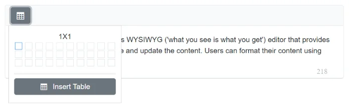

## Quick Toolbar

The Quick Toolbar opens when the table is clicked. It provides a context-specific set of commands for editing the table. See [Quick Toolbars](./quick-toolbar#table-quick-toolbar) for the full list of available items.

## Table Header

The `TableHeader` command is available with the Quick Toolbar option through which the header row can be added or removed from the inserted table. The following image illustrates the table header.

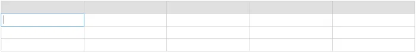

## Insert Rows

`Rows` can be inserted above or below the required table cell through the Quick Toolbar. The focused row can also be deleted. The following screenshot shows the available options of the row item.

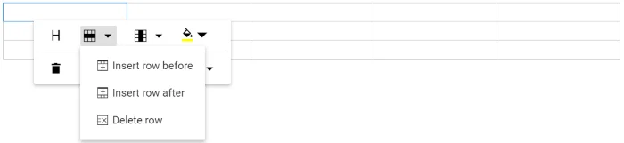

## Insert Columns

`Columns` can be inserted to the left or right side of the required table cell through the Quick Toolbar. The focused column can also be deleted. The following screenshot shows the available options of the column item.

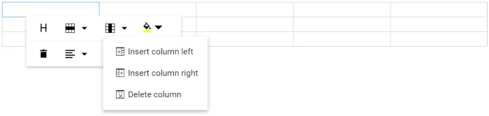

## Set Color

The Background Color can be set for each table cell through the `BackgroundColor` command available with the Quick Toolbar.

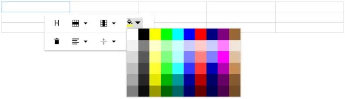

## Delete Table

Using the delete item in the Quick Toolbar, users can delete the entire table.

## Vertical Align

Text inside the table can be aligned to top, middle, or bottom using the `TableCellVerticalAlign` command of the quick toolbar.

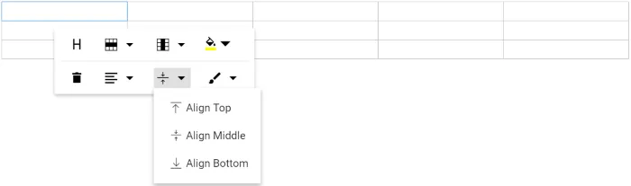

## Horizontal Align

Text inside the table can be aligned left, right, or center using the `TableCellHorizontalAlign` command of the quick toolbar.

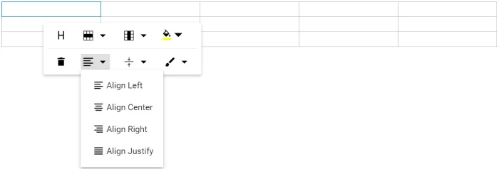

## Table Styles

Table styles provided for the class name should be appended to a table element. They help design the table in specific CSS styles when inserted in the editor.

By default, the editor provides `Dashed border` and `Alternate rows` styles.

* **Dashed border**: Applies a dashed border to the table.
* **Alternate rows**: Applies an alternating background color to table rows.

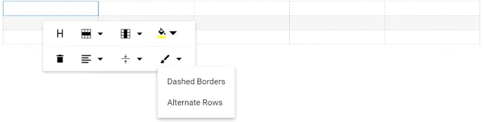

### Custom Styles

Rich Text Editor provides support to custom styles for tables. If you want to add additional styles, pass the styles information as `List<DropDownItemModel>` data to the `Styles` field of `RichTextEditorTableSettings` tag.

```cshtml

<SfRichTextEditor>
    <RichTextEditorTableSettings Styles="@StyleItems" />
    <RichTextEditorToolbarSettings Items="@Tools" />
</SfRichTextEditor>

@code{
    private List<ToolbarItemModel> Tools = new List<ToolbarItemModel>()
    {
        new ToolbarItemModel() { Command = ToolbarCommand.CreateTable }
    };

    private List<DropDownItemModel> StyleItems = new List<DropDownItemModel>()
    {
        new DropDownItemModel() { Text = "Alternate Rows" }
    };
}

```

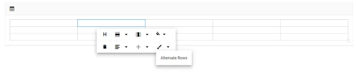

## Table Properties

Sets the default width of the table when it is inserted in the Rich Text Editor using the `Width` property of `RichTextEditorTableSettings`.

Using the Quick Toolbar, users can change the width, cell padding, and cell spacing in the selected table using the `TableEditProperties` command dialog action.

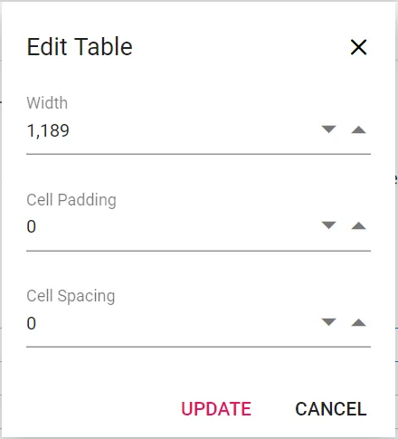

N> You can refer to our [Blazor Rich Text Editor](https://www.syncfusion.com/rich-text-editor-sdk/blazor-rich-text-editor) feature tour page for its groundbreaking feature representations. You can also explore our [Blazor Rich Text Editor](https://blazor.syncfusion.com/demos/rich-text-editor/overview?theme=fluent2) example to know how to render and configure the rich text editor tools.

## Table cell merge and split

The Rich Text Editor allows users to change the appearance of the tables by splitting or merging the table cells.

The `TableCell` item should be configured in the Table [quickToolbarSettings](./quick-toolbar#table-quick-toolbar) property to show the merge/split icons while selecting the table cells.

### Table cell merge

The table cell merge feature allows merging two or more row and column cells into a single cell with its contents.

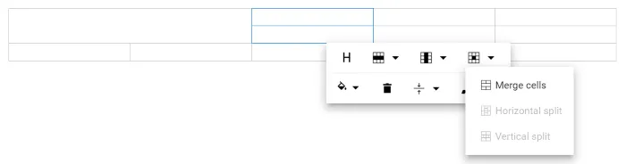

### Table cell split

The table cell split feature allows to a selected cell can be split both horizontally and vertically.

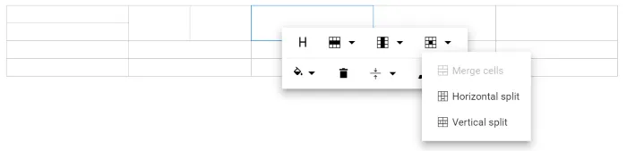

## See also

* [Quick Toolbars](./quick-toolbar)
* [Toolbar customization](./tools/built-in-tools)