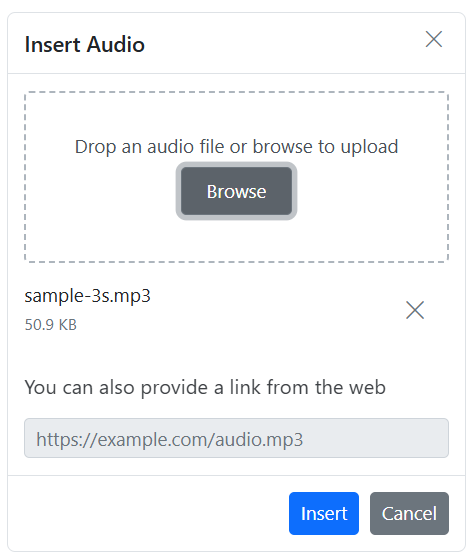

# Audios in JavaScript Rich text editor control

The Rich Text Editor allows you to insert audio from online sources and local computers and then insert them into your content. You can insert the audio with the following list of options in the [insertAudioSettings](https://ej2.syncfusion.com/documentation/api/rich-text-editor/index-default#insertaudiosettings) property.

## Configuring the audio tool in the toolbar

You can add an `Audio` tool in the Rich Text Editor toolbar using the `toolbarSettings` [items](https://ej2.syncfusion.com/documentation/api/rich-text-editor/toolbarsettings#items) property.

To configure the `Audio` toolbar item, refer to the below code.











        
















## Audio save formats

The audio files can be saved as `Blob` or `Base64` URL by using the [insertAudioSettings.saveFormat](https://ej2.syncfusion.com/documentation/api/rich-text-editor/audiosettingsmodel#saveformat) property, which is of enum type, and the generated URL will be set to the `src` attribute of the `<source>` tag.

> The default `saveFormat` property is set to `Blob` format.

```HTML

<audio>
    <source src="blob:https://ej2.syncfusion.com/3ab56a6e-ec0d-490f-85a5-f0aeb0ad8879" type="audio/mp3" >
</audio>

<audio>
    <source src="data:audio/mp3;base64,iVBORw0KGgoAAAANSUhEUgAAADAAAAAwCAYAAABXAvmHA" type="audio/mp3" >
</audio>

```

## Insert audio from the Web

You can insert audio from either the hosted link or the local machine, by clicking the audio button in the editor's toolbar. On clicking the audio button, a dialog opens, which allows you to insert audio from the web URL.

### Inserting audio from web URLs

By default, the audio tool opens the audio dialog, allowing you to insert audio from an online source. Inserting the URL will be added to the `src` attribute of the `<source>` tag.


## Uploading audio from local machine

You can use the `browse` option on the audio dialog, to select the audio from the local machine and insert it into the Rich Text Editor content.

If the path field is not specified in the [insertAudioSettings](https://ej2.syncfusion.com/documentation/api/rich-text-editor/index-default#insertaudiosettings), the audio will be converted into the `Blob` URL or `Base64` and inserted inside the Rich Text Editor.

## Maximum file size restriction

You can restrict the audio uploaded from the local machine when the uploaded audio file size is greater than the allowed size by using the [maxFileSize](https://helpej2.syncfusion.com/documentation/api/rich-text-editor/audiosettingsmodel#maxfilesize) property. By default, the maximum file size is 30000000 bytes. You can configure this size as follows.

```ts

    insertAudioSettings: {
      maxFileSize: 10000000
    }

```

In the following illustration, the audio size has been validated before uploading, and it is determined whether the audio has been uploaded or not.

























## Saving audio to the server

[saveFormat](https://helpej2.syncfusion.com/documentation/api/rich-text-editor/audiosettingsmodel#saveformat) Sets the default save format of the audio element when inserted. Possible options are: `Blob` and `Base64`.

[saveUrl](https://helpej2.syncfusion.com/documentation/api/rich-text-editor/audiosettingsmodel#saveurl) provides URL to map the action result method to save the audio.

[removeUrl](https://helpej2.syncfusion.com/documentation/api/rich-text-editor/audiosettingsmodel#removeurl) provides URL to map the action result method to remove the audio.

### Server-side action

The selected audio can be uploaded to the required destination using the controller action below. Map this method name in [insertAudioSettings.saveUrl](https://helpej2.syncfusion.com/documentation/api/rich-text-editor/audiosettingsmodel#saveurl) and provide the required destination path through [insertAudioSettings.path](https://ej2.syncfusion.com/documentation/api/rich-text-editor/audiosettingsmodel#path) properties.

> If you want to insert lower-sized audio files in the editor and don't want a specific physical location for saving the audio, you can opt to save the format as `Base64`.

In the following code blocks, the audio module has been injected and can insert the audio files saved in the specified path.


























```c#

using System;
using System.IO;
using FileUpload.Models;
using System.Diagnostics;
using System.Net.Http.Headers;
using Microsoft.AspNetCore.Mvc;
using Microsoft.AspNetCore.Http;
using System.Collections.Generic;
using Microsoft.AspNetCore.Hosting;

namespace FileUpload.Controllers
{
    public class HomeController : Controller
    {
        private IHostingEnvironment hostingEnv;

        public HomeController(IHostingEnvironment env)
        {
            hostingEnv = env;
        }

        public IActionResult Index()
        {
            return View();
        }

        [AcceptVerbs("Post")]
        public void SaveFiles(IList<IFormFile> UploadFiles)
        {
            try
            {
                foreach (IFormFile file in UploadFiles)
                {
                    if (UploadFiles != null)
                    {
                        string filename = ContentDispositionHeaderValue.Parse(file.ContentDisposition).FileName.Trim('"');
                        filename = hostingEnv.WebRootPath + "\\Files" + $@"\{filename}";

                        // Create a new directory, if it does not exists
                        if (!Directory.Exists(hostingEnv.WebRootPath + "\\Files"))
                        {
                            Directory.CreateDirectory(hostingEnv.WebRootPath + "\\Files");
                        }

                        if (!System.IO.File.Exists(filename))
                        {
                            using (FileStream fs = System.IO.File.Create(filename))
                            {
                                file.CopyTo(fs);
                                fs.Flush();
                            }
                            Response.StatusCode = 200;
                        }
                    }
                }
            }
            catch (Exception)
            {
                Response.StatusCode = 204;
            }
        }

        [ResponseCache(Duration = 0, Location = ResponseCacheLocation.None, NoStore = true)]
        public IActionResult Error()
        {
            return View(new ErrorViewModel { RequestId = Activity.Current?.Id ?? HttpContext.TraceIdentifier });
        }
    }
}

```

### Renaming audio before inserting

You can use the [insertAudioSettings](https://ej2.syncfusion.com/documentation/api/rich-text-editor/index-default#insertaudiosettings) property, to specify the server handler to upload the selected audio. Then by binding the [fileUploadSuccess](https://ej2.syncfusion.com/documentation/api/rich-text-editor/index-default#fileuploadsuccess) event, you can receive the modified file name from the server and update it in the Rich Text Editor's insert audio dialog.


























To configure server-side handler, refer to the below code.

```c#
int x = 0;
string file;
[AcceptVerbs("Post")]
public void Rename()
{
    try
    {
        var httpPostedFile = System.Web.HttpContext.Current.Request.Files["UploadFiles"];
        fileName = httpPostedFile.FileName;
        if (httpPostedFile != null)
        {
            var fileSave = System.Web.HttpContext.Current.Server.MapPath("~/Files");
            if (!Directory.Exists(fileSave))
            {
                Directory.CreateDirectory(fileSave);
            }
            var fileName = Path.GetFileName(httpPostedFile.FileName);
            var fileSavePath = Path.Combine(fileSave, fileName);
            while (System.IO.File.Exists(fileSavePath))
            {
                fileName = "rteFiles" + x + "-" + fileName;
                fileSavePath = Path.Combine(fileSave, fileName);
                x++;
            }
            if (!System.IO.File.Exists(fileSavePath))
            {
                httpPostedFile.SaveAs(fileSavePath);
                HttpResponse Response = System.Web.HttpContext.Current.Response;
                Response.Clear();
                Response.Headers.Add("name", fileName);
                Response.ContentType = "application/json; charset=utf-8";
                Response.StatusDescription = "File uploaded succesfully";
                Response.End();
            }
        }
    }
    catch (Exception e)
    {
        HttpResponse Response = System.Web.HttpContext.Current.Response;
        Response.Clear();
        Response.ContentType = "application/json; charset=utf-8";
        Response.StatusCode = 204;
        Response.Status = "204 No Content";
        Response.StatusDescription = e.Message;
        Response.End();
    }
}

```

### Uploading audio with authentication

You can add additional data with the audio uploaded from the Rich Text Editor on the client side, which can even be received on the server side by using the [fileUploading](https://ej2.syncfusion.com/documentation/api/rich-text-editor/index-default#fileuploading) event and its `customFormData` argument, you can pass parameters to the controller action. On the server side, you can fetch the custom headers by accessing the form collection from the current request, which retrieves the values sent using the POST method.

> By default, it doesn't support the `UseDefaultCredentials` property; we need to manually append the default credentials with the upload request.

























```c#

public void SaveFiles(IList<IFormFile> UploadFiles)
{
    string currentPath = Request.Form["Authorization"].ToString();
}

```

## Audio replacement functionality

Once an audio file has been inserted, you can change it using the Rich Text Editor [quickToolbarSettings](https://ej2.syncfusion.com/documentation/api/rich-text-editor/index-default#quicktoolbarsettings) `audioReplace` option. You can replace the audio file using the web URL or the browse option in the audio dialog.


## Deleting audios

To remove audio from the Rich Text Editor content, select the audio and click the `audioRemove` button from the quick toolbar. It will delete the audio from the Rich Text Editor content as well as from the service location if the [insertAudioSettings.removeUrl](https://helpej2.syncfusion.com/documentation/api/rich-text-editor/audiosettingsmodel#removeurl) is given.

Once you select the audio from the local machine, the URL for the audio will be generated. You can remove the audio from the service location by clicking the cross icon.



## Configuring audio display position

Sets the default display property for audio when it is inserted in the Rich Text Editor using the [insertAudioSettings.layoutOption](https://helpej2.syncfusion.com/documentation/api/rich-text-editor/audiosettingsmodel#layoutoption) property. It has two possible options: `Inline` and `Break`. When updating the display positions, it updates the audio elements’ layout position.

> The default `layoutOption` property is set to `Inline`.

























## Drag and drop audio insertion

By default, the Rich Text Editor allows you to insert audios by drag-and-drop from the local file system such as Windows Explorer into the content editor area. And, you can upload the audios to the server before inserting into the editor by configuring the saveUrl property.

In the following sample, you can see feature demo.











        
















### Disabling audio drag and drop

You can prevent drag-and-drop action by setting the actionBegin argument cancel value to true. The following code shows how to prevent the drag-and-drop.

``` ts

    actionBegin: function (args: any): void {
        if(args.type === 'drop' || args.type === 'dragstart') {
            args.cancel =true;
        }
    }

```

## Customizing the Audio Quick Toolbar

The Rich Text Editor enables customization of the audio quick toolbar, allowing you to tailor its functionality with Essential tools such as AudioReplace, Remove, and AudioLayoutOption.

By configuring these options in the [quickToolbarSettings](https://ej2.syncfusion.com/documentation/api/rich-text-editor/index-default#quicktoolbarsettings) property, you enhance the editor's capabilities, facilitating seamless management and editing of audio directly within your content. This customization ensures a user-friendly experience for manipulating audio elements efficiently.
























        




## See Also

* [Quick Toolbars in the Toolbar](https://ej2.syncfusion.com/documentation/rich-text-editor/toolbar/toolbar-types#quick-inline-toolbar)
* [How to Use the Video Editing Option in Toolbar Items](https://ej2.syncfusion.com/documentation/rich-text-editor/insert-image-media/video)
* [How to Use the Image Editing Option in Toolbar Items](./insert-images)
* [Audio Quick Toolbar](../toolbar/quick-toolbar#audio-quick-toolbar)