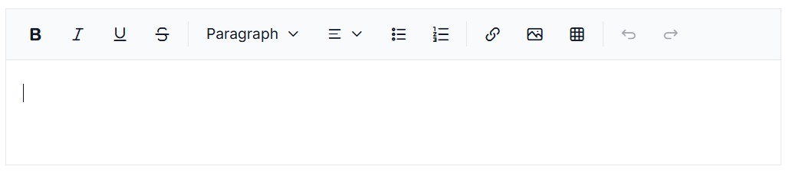

# Getting started in JavaScript Modern Rich Text Editor

The Essential JS 2 for JavaScript (global script) is an ES5-formatted pure JavaScript framework that can be directly used in the latest web browsers.

## Dependencies

The following list of dependencies are required to use the `Modern Rich Text Editor` control in the application.

```javascript
|-- @syncfusion/ej2-richtexteditor-ui
    |-- @syncfusion/ej2-base
    |-- @syncfusion/ej2-dropdowns
    |-- @syncfusion/ej2-inputs
    |-- @syncfusion/ej2-navigations
    |-- @syncfusion/ej2-popups
    |-- @syncfusion/ej2-splitbuttons

```
## Setup for local development

Refer to the following steps to set up your local environment.

**Step 1:** Create an app folder `my-app` for Essential JS 2 JavaScript controls.

**Step 2:** Create a `my-app/resources` folder to store local script and style files.

**Step 3:** Open Visual Studio Code and create `my-app/index.js` and `my-app/index.html` files for initializing the Essential JS 2 Modern Rich Text Editor control.

## Adding Modern Rich Text Editor styles

Add the following styles inside the `my-app/index.html` file to include the `tailwind3` theme styles:





<link href="https://cdn.syncfusion.com/ej2/{{site.ej2version}}/ej2-base/styles/tailwind3.css" rel="stylesheet">
<link href="https://cdn.syncfusion.com/ej2/{{site.ej2version}}/ej2-dropdowns/styles/tailwind3.css" rel="stylesheet">
<link href="https://cdn.syncfusion.com/ej2/{{site.ej2version}}/ej2-inputs/styles/tailwind3.css" rel="stylesheet">
<link href="https://cdn.syncfusion.com/ej2/{{site.ej2version}}/ej2-navigations/styles/tailwind3.css" rel="stylesheet">
<link href="https://cdn.syncfusion.com/ej2/{{site.ej2version}}/ej2-popups/styles/tailwind3.css" rel="stylesheet">
<link href="https://cdn.syncfusion.com/ej2/{{site.ej2version}}/ej2-splitbuttons/styles/tailwind3.css" rel="stylesheet">
<link href="https://cdn.syncfusion.com/ej2/{{site.ej2version}}/ej2-richtexteditor-ui/styles/tailwind3.css" rel="stylesheet">




I> Ensure that all Modern Rich Text Editor theme style files are loaded in the exact order shown above. The order is important because these styles have dependencies, and loading them incorrectly may cause styling issues in the controls. You can also refer to the [themes section](https://ej2.syncfusion.com/documentation/appearance/theme) for details about built-in themes and CSS references for individual controls.

## Adding Modern Rich Text Editor scripts

Add the following scripts inside the `my-app/index.html` file to include the Modern Rich Text Editor functionality:




<script src="https://cdn.syncfusion.com/ej2/{{site.ej2version}}/ej2-base/dist/global/ej2-base.min.js" type="text/javascript"></script>
<script src="https://cdn.syncfusion.com/ej2/{{site.ej2version}}/ej2-popups/dist/global/ej2-popups.min.js" type="text/javascript"></script>
<script src="https://cdn.syncfusion.com/ej2/{{site.ej2version}}/ej2-dropdowns/dist/global/ej2-dropdowns.min.js" type="text/javascript"></script>
<script src="https://cdn.syncfusion.com/ej2/{{site.ej2version}}/ej2-inputs/dist/global/ej2-inputs.min.js" type="text/javascript"></script>
<script src="https://cdn.syncfusion.com/ej2/{{site.ej2version}}/ej2-navigations/dist/global/ej2-navigations.min.js" type="text/javascript"></script>
<script src="https://cdn.syncfusion.com/ej2/{{site.ej2version}}/ej2-splitbuttons/dist/global/ej2-splitbuttons.min.js" type="text/javascript"></script>
<script src="https://cdn.syncfusion.com/ej2/{{site.ej2version}}/ej2-richtexteditor-ui/dist/global/ej2-richtexteditor-ui.min.js" type="text/javascript"></script>




I> Ensure that all Modern Rich Text Editor script files are loaded in the correct order and included before initializing the control. The order is important because the scripts have dependencies, and loading them incorrectly may prevent the Modern Rich Text Editor from working properly or cause runtime errors. Make sure the required base and dependent scripts are included along with the Modern Rich Text Editor script.

## Adding Modern Rich Text Editor control

Add the Modern Rich Text Editor control to the application as follows. Place the target element in **index.html** and the initialization code in **index.js** using the sample below.

> Add a target element such as `<div id="editor"></div>` in `index.html` before calling `appendTo` in `index.js`.

The Modern Rich Text Editor can be initialized on a `div` element, as shown below:










## Run the Application

Run the `index.html` file through a local web server (for example, `npx http-server` or VS Code Live Server). Opening the file directly with `file://` may break script loading.

The Syncfusion<sup style="font-size:70%">&reg;</sup> JavaScript Modern Rich Text Editor is displayed as shown below.


