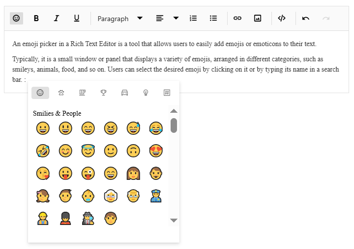

# Emoji Picker in React Rich Text Editor Component

The Emoji Picker is a tool that simplifies adding emojis or emoticons to text content within the Syncfusion React Rich Text Editor. It appears as a popup panel displaying a variety of emojis organized into categories such as Smilies & People, Animals & Nature, and more. Users can select an emoji by clicking it or searching for it by name using the built-in search box.

## Configuring emoji picker tool in the toolbar

Add the `EmojiPicker` tool to the Rich Text Editor toolbar using the [toolbarSettings.items](https://ej2.syncfusion.com/react/documentation/api/rich-text-editor/index-default#toolbarsettings) property.

By default, a predefined set of emojis is configured. However, these icons can be customized according to specific needs by using the  [emojiPickerSettings](https://ej2.syncfusion.com/react/documentation/api/rich-text-editor/index-default#emojipickersettings) property.

```ts
import { RichTextEditorComponent, Inject, Toolbar, HtmlEditor, Image, QuickToolbar, Link, EmojiPicker } from '@syncfusion/ej2-react-richtexteditor';
import * as React from 'react';

class App extends React.Component<{},{}> {
  private toolbarSettings: object = {
    items: ['Bold', 'Italic', 'Underline', '|', 'Formats', 'Alignments', 'OrderedList',
        'UnorderedList', '|', 'CreateLink', 'Image', '|', 'SourceCode', 'EmojiPicker', '|', 'Undo', 'Redo'
    ]
  }
  private emojiPickerSettings: object = {
    iconsSet: [{name: 'Smilies & People', code: '1F600', iconCss: 'e-emoji', 
                icons: [{ code: '1F600', desc: 'Grinning face' },
                { code: '1F603', desc: 'Grinning face with big eyes' },
                { code: '1F604', desc: 'Grinning face with smiling eyes' },
                { code: '1F606', desc: 'Grinning squinting face' },
                { code: '1F605', desc: 'Grinning face with sweat' },
                { code: '1F602', desc: 'Face with tears of joy' },
                { code: '1F923', desc: 'Rolling on the floor laughing' },
                { code: '1F60A', desc: 'Smiling face with smiling eyes' }]
                }, {
                name: 'Animals & Nature', code: '1F435', iconCss: 'e-animals',
                icons: [{ code: '1F436', desc: 'Dog face' },
                { code: '1F431', desc: 'Cat face' },
                { code: '1F42D', desc: 'Mouse face' },
                { code: '1F439', desc: 'Hamster face' },
                { code: '1F430', desc: 'Rabbit face' },
                { code: '1F98A', desc: 'Fox face' }]
                }, {
                name: 'Food & Drink', code: '1F347', iconCss: 'e-food-and-drinks',
                icons: [{ code: '1F34E', desc: 'Red apple' },
                { code: '1F34C', desc: 'Banana' },
                { code: '1F347', desc: 'Grapes' },
                { code: '1F353', desc: 'Strawberry' },
                { code: '1F35E', desc: 'Bread' },
                { code: '1F950', desc: 'Croissant' },
                { code: '1F955', desc: 'Carrot' },
                { code: '1F354', desc: 'Hamburger' }]
                }, {
                name: 'Activities', code: '1F383', iconCss: 'e-activities',
                icons: [{ code: '26BD', desc: 'Soccer ball' },
                { code: '1F3C0', desc: 'Basketball' },
                { code: '1F3C8', desc: 'American football' },
                { code: '26BE', desc: 'Baseball' },
                { code: '1F3BE', desc: 'Tennis' },
                { code: '1F3D0', desc: 'Volleyball' },
                { code: '1F3C9', desc: 'Rugby football' }]
                }, {
                name: 'Travel & Places', code: '1F30D', iconCss: 'e-travel-and-places',
                icons: [{ code: '2708', desc: 'Airplane' },
                { code: '1F697', desc: 'Automobile' },
                { code: '1F695', desc: 'Taxi' },
                { code: '1F6B2', desc: 'Bicycle' },
                { code: '1F68C', desc: 'Bus' }]
                }, {
                name: 'Objects', code: '1F507', iconCss: 'e-objects', icons: [{ code: '1F4A1', desc: 'Light bulb' },
                { code: '1F526', desc: 'Flashlight' },
                { code: '1F4BB', desc: 'Laptop computer' },
                { code: '1F5A5', desc: 'Desktop computer' },
                { code: '1F5A8', desc: 'Printer' },
                { code: '1F4F7', desc: 'Camera' },
                { code: '1F4F8', desc: 'Camera with flash' },
                { code: '1F4FD', desc: 'Film projector' }]
                }, {
                name: 'Symbols', code: '1F3E7', iconCss: 'e-symbols', icons: [{ code: '274C', desc: 'Cross mark' },
                { code: '2714', desc: 'Check mark' },
                { code: '26A0', desc: 'Warning sign' },
                { code: '1F6AB', desc: 'Prohibited' },
                { code: '2139', desc: 'Information' },
                { code: '267B', desc: 'Recycling symbol' },
                { code: '1F6AD', desc: 'No smoking' }]
                }]
  }
  public render() {
    return (
      <RichTextEditorComponent height={450} toolbarSettings={this.toolbarSettings} emojiPickerSettings={
        this.emojiPickerSettings}>

        <Inject services={[Toolbar, Audio, Link, HtmlEditor, QuickToolbar, EmojiPicker]} />
      </RichTextEditorComponent>
    );
  }
}

export default App;

```

Additionally, you have the option to customize the icons of toolbar items using the [iconCss](https://helpej2.syncfusion.com/react/documentation/api/rich-text-editor/emojiiconsset#iconcss) and [code](https://helpej2.syncfusion.com/react/documentation/api/rich-text-editor/emojiiconsset#code) properties. The `iconCss` property applies a custom CSS class to style the category icon, while the `code` property enables you to specify the Unicode character code for the icon.

When both `iconCSS` and `code` properties are provided, the `iconCSS` property takes precedence in determining the appearance of the toolbar item icon.

Additionally, you have the option to enhance the user experience by implementing a filtering feature for efficiently managing a large dataset of emojis. By setting the [showSearchBox](https://helpej2.syncfusion.com/react/documentation/api/rich-text-editor/emojisettings#showSearchBox) property to `true` (which is the default value), users will be able to utilize a search box to filter the displayed emojis according to their preferences.

The following example demonstrates how to add the Emoji Picker tool to the Rich Text Editor.

`[Class-component]`












`[Functional-component]`










 

> To use Emoji Picker feature, inject Emoji Picker module using the `<Inject services={[EmojiPicker]} />`.

## Keyboard interaction

The Emoji Picker supports efficient keyboard navigation and selection, enhancing accessibility and user experience. Users can open the picker, navigate emojis, and select them using keyboard shortcuts.

## Opening the emoji picker with shortcut keys

Quickly access the emoji picker by pressing the colon (`:`) key while typing a word prefix in an editor, allowing instant emoji selection and display. Moreover, continue typing in the editor after the colon (:) to filter and refine your search for the desired emojis.



## Navigating and selecting emojis using the keyboard

The emoji picker popup offers keyboard navigation options, allowing you to move the emoji focus from one emoji to another. The following keys are used for navigation:

`Arrow keys`: Use the arrow keys (up, down, left, right) to move the emoji focus in the corresponding direction.

`Enter`: Press Enter key to select the currently focused emoji.

`Escape`: Press Escape to close the emoji picker popup without selecting an emoji.
