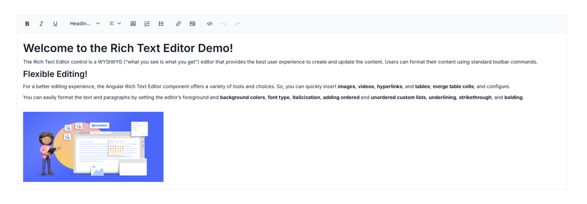
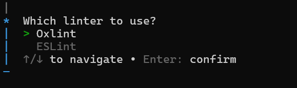
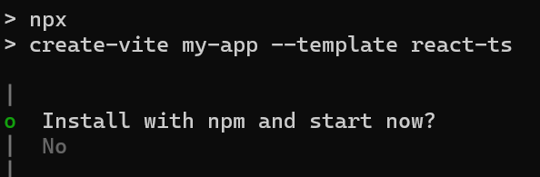
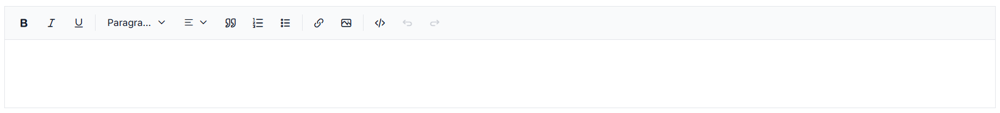

# Getting Started with React Rich Text Editor

The [React Rich Text Editor](https://www.syncfusion.com/react-components/react-rich-text-editor) is a <abbr title="What You See Is What You Get">WYSIWYG</abbr> editor that enables users to create, edit, and format rich text content with features like multimedia insertion, lists, and links. This section explains the steps to create a simple React Rich Text Editor and demonstrates the basic usage of the Rich Text Editor control using a Vite-based React project scaffolded with the latest Vite version.

> **Ready to streamline your Syncfusion<sup style="font-size:70%">&reg;</sup> React development?** Discover the full potential of Syncfusion<sup style="font-size:70%">&reg;</sup> React components with Syncfusion<sup style="font-size:70%">&reg;</sup> AI Coding Assistant. Effortlessly integrate, configure, and enhance your projects with intelligent, context-aware code suggestions, streamlined setups, and real-time insights—all seamlessly integrated into your preferred AI-powered IDEs like VS Code, Cursor, Syncfusion<sup style="font-size:70%">&reg;</sup> CodeStudio and more. [Explore Syncfusion<sup style="font-size:70%">&reg;</sup> AI Coding Assistant](https://ej2.syncfusion.com/react/documentation/mcp-server/ai-coding-assistant/getting-started)

To get started quickly with the React Rich Text Editor, refer to this video tutorial:







## Prerequisites

- [Node.js 24+](https://nodejs.org/en) (LTS recommended).
- Syncfusion CLI.

## Install the Syncfusion CLI 

Install the Syncfusion CLI globally using the following command:



npm install -g @syncfusion/syncfusion-cli



## Set up the Vite project using Syncfusion CLI

You can create a React Vite application using the Syncfusion CLI. The CLI provides two ways to create a project:

### Non-interactive mode

Non-interactive mode allows you to create a project directly using a single command with the required command-line arguments.



sf new my-app --framework react --type ts --template rich-text-editor --theme tailwind3



In this mode, the project configuration is passed directly in the command. The above command creates a React Vite application configured with the Syncfusion<sup style="font-size:70%">&reg;</sup> `Rich Text Editor` component.

### Interactive mode

Interactive mode guides you through the project creation process with step-by-step prompts.



sf



When you run the `sf` command, the CLI prompts you to select the required project configuration. To create a React Vite application with the Syncfusion<sup style="font-size:70%">&reg;</sup> `Rich Text Editor` component, select the following options:




√ Project name? ... my-app
√ Choose Framework: » React
√ Choose Build Tool: » Vite
√ Choose Language: » Typescript
√ Choose Template: » Rich Text Editor
√ Choose Theme: » Tailwind3
√ Choose Style Format: » CSS
√ Would you like to integrate the Syncfusion MCP Server (AI Assistant) into this project? ... no
√ Would you like to install Syncfusion Component Skills for AI-powered development? ... no      
√ Install dependencies and start app now? ... no




The above selections generate a React Vite application configured with the Syncfusion<sup style="font-size:70%">&reg;</sup> `Rich Text Editor` component. You can choose different values for language, theme, style format, MCP setup, and skills installation based on your project requirements.

The Syncfusion<sup style="font-size:70%">&reg;</sup> CLI creates the project with a predefined template. After the project is generated, you can customize or replace the component code based on your application requirements.

## Run the project

Once the project is created, navigate to the project directory and run the following commands in your terminal.



cd my-app
npm install
npm run dev



The output will appear as follows:







## Prerequisites

This guide uses Vite as the bundler and development environment. Install Node.js `24.13.0` or `higher` before proceeding. For detailed information about Vite’s capabilities and configuration options, refer to the [Vite documentation](https://vitejs.dev/).

N> For information about supported React versions and Syncfusion package compatibility, refer to the [Version Compatibility](https://ej2.syncfusion.com/react/documentation/upgrade/version-compatibility) documentation.

## Create a React Application

Run the following commands to set up a React application:

```bash
npm create vite@latest my-app -- --template react-ts
```

This command prompts you to configure the React application. When prompted to choose a linter, select either Oxlint or ESLint based on your preference.



Continue with the project setup and select the options as shown below.



As Syncfusion packages are not installed yet, currently, the `No` option will be selected. Then, navigate to the project directory and install the dependencies using the following commands:

```bash
cd my-app
npm install
```

N> To set up a React application with Nextjs or Remix, refer to this [documentation](https://ej2.syncfusion.com/react/documentation/getting-started/quick-start) for more details.

## Adding Syncfusion<sup style="font-size:70%">&reg;</sup> Rich Text Editor packages

All the available Essential<sup style="font-size:70%">&reg;</sup> JS 2 packages are published in the [`npmjs.com`](https://www.npmjs.com/~syncfusionorg) public registry.
To install Rich Text Editor component, use the following command

```bash
npm install @syncfusion/ej2-react-richtexteditor
```

## Adding CSS reference

Syncfusion provides multiple themes for the Rich Text Editor component. For a complete list of available themes, refer to the [themes packages](https://ej2.syncfusion.com/react/documentation/appearance/theme#theme-packages). 

To apply the [Tailwind 3](https://www.npmjs.com/package/@syncfusion/ej2-tailwind3-theme) theme, install the corresponding theme package by using the following command:

```bash
npm install @syncfusion/ej2-tailwind3-theme
```

The installed theme package includes an `index.css` file that automatically imports all the required dependency styles. Import the following stylesheet into **src/App.css**:

```css
@import '../node_modules/@syncfusion/ej2-tailwind3-theme/styles/rich-text-editor/index.css';
```

I> To apply the application-specific styles correctly, import **App.css** into **src/App.tsx** and remove all the default styles from **src/index.css**.

## Module injection

The following modules provide the basic features of the the Rich Text Editor.

* **HtmlEditor** - Inject this module to use the Rich Text Editor as HTML editor.
* **Image** - Inject this module to use image feature in the Rich Text Editor.
* **Link** - Inject this module to use link feature in the Rich Text Editor.
* **QuickToolbar** - Inject this module to use the quick toolbar feature for the target element.
* **Toolbar** - Inject this module to use the Toolbar feature.

These modules can be injected into the `services` prop of the `<Inject>` component, as demonstrated in the following example.










T> Additional feature modules are available [here](https://ej2.syncfusion.com/react/documentation/rich-text-editor/module).

## Adding Rich Text Editor component

Now, you can start adding the React Rich Text Editor component in the application. For getting started, replace the default Vite template content in **src/App.tsx** with the following sample.










@import '../node_modules/@syncfusion/ej2-tailwind3-theme/styles/rich-text-editor/index.css';




## Run the Application

Now run the `npm run dev` command in the console to start the development server. This command compiles your code and serves the application locally, opening it in the browser.

```bash
npm run dev
```
The Syncfusion<sup style="font-size:70%">&reg;</sup> React Rich Text Editor is displayed in the browser as shown below.






## See Also

* [Accessibility in Rich Text Editor](./accessibility.md)
* [Keyboard support in Rich Text Editor](./keyboard-support.md)
* [Globalization in Rich Text Editor](./globalization.md)

N> Looking for the full React Rich Text Editor component overview, features, pricing, and documentation? Visit the [React Rich Text Editor](https://www.syncfusion.com/react-components/react-rich-text-editor) page.
