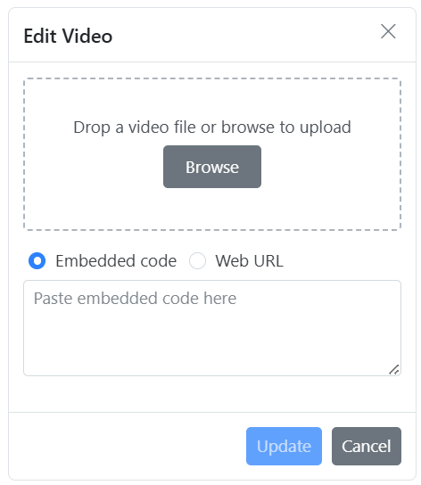
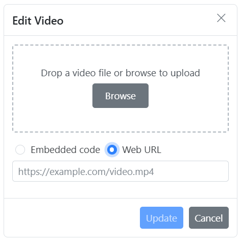
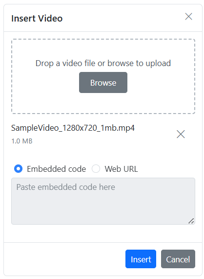
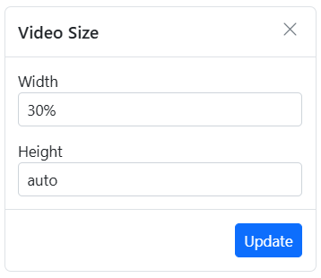

# Insert Videos in React Rich Text Editor

The Rich Text Editor enables insertion of video from online sources and local machines, into your content.  You can insert the video with the following list of options in the [insertVideoSettings](https://ej2.syncfusion.com/react/documentation/api/rich-text-editor/index-default#insertvideosettings) property.

## Configuring the Video Toolbar Item

The video feature is enabled by adding the `Video` item to the toolbar using the [toolbarSettings.items](https://ej2.syncfusion.com/react/documentation/api/rich-text-editor/toolbarsettings#items) property.

### Setup

Import and inject the `Video` module:

```tsx
import { RichTextEditorComponent, Inject, HtmlEditor, Toolbar, Video } from '@syncfusion/ej2-react-richtexteditor';

<RichTextEditorComponent toolbarSettings={{ items: ['Video'] }}>
  <Inject services={[HtmlEditor, Toolbar, Video]} />
</RichTextEditorComponent>
```

> Rich Text Editor features use individual feature-wise modules. To enable video insertion, inject the `Video` module in the services array.

The following example demonstrates configuring the `Video` toolbar item:

`[Class-component]`










 

`[Functional-component]`










 

## Video Save Formats

The video files can be saved as `Blob` or `Base64` URLs by using the [insertVideoSettings.saveFormat](https://ej2.syncfusion.com/react/documentation/api/rich-text-editor/videosettingsmodel#saveformat) property, which is of enum type, and the generated URL will be set to the `src` attribute of the `<source>` tag.

> The default `saveFormat` property is set to `Blob` format.

```html

<video>
    <source src="blob:http://ej2.syncfusion.com/3ab56a6e-ec0d-490f-85a5-f0aeb0ad8879" type="video/mp4">
</video>

<video>
    <source src="data:video/mp4;base64,iVBORw0KGgoAAAANSUhEUgAAADAAAAAwCAYAAABXAvmHA" type="video/mp4">
</video>

```

## Inserting Video

You can insert a video from either a hosted link or your local machine by clicking the video button in the editor's toolbar. When you click the video button, a dialog opens, allowing you to insert a video using an Embedded code or Web URL.

### Inserting Video from Embedded Code

The `Video` toolbar item opens a dialog with options to insert videos via an embedded code or web URL. The `Embedded code` option is selected by default, allowing insertion of embed codes from platforms like YouTube.


### Inserting video from web URL

Switch to the `Web URL` option by selecting the Web URL checkbox. Inserting a video using the Web URL option adds the video URL as the `src` attribute of the `<source>` tag and provides direct video file playback.


## Uploading Video from Local Machine

The video dialog includes a `browse` option to select video files from a local machine and insert it into the Rich Text Editor content.

If the [insertVideoSettings.path](https://ej2.syncfusion.com/react/documentation/api/rich-text-editor/index-default#insertvideosettings) is not specified, the video is converted to a `Blob` or `Base64` URL and inserted into the Rich Text Editor.

## Restricting Maximum File Size

You can restrict video uploads from your local machine using the [insertVideoSettings.maxFileSize](https://ej2.syncfusion.com/react/documentation/api/rich-text-editor/videosettings#maxfilesize) property. By default, the maximum file size is 300000000 bytes (approximately 300 MB).

In the following example, the video size has been validated before uploading and determined whether the video has been uploaded or not.

`[Class-component]`

```ts

import { HtmlEditor, Image, Inject, Link, QuickToolbar, RichTextEditorComponent, Toolbar, Table, Video, PasteCleanup } from '@syncfusion/ej2-react-richtexteditor';
import * as React from 'react';

class App extends React.Component<{},{}> {
  private toolbarSettings: object = {
    items: ['Video', 'Bold', 'Italic', 'Underline', '|', 'Formats', 'Alignments', 'Blockquote', 'OrderedList', 'UnorderedList', '|', 'CreateLink', 'CreateTable', 'Image', '|', 'SourceCode', '|', 'Undo', 'Redo']
  }
  private insertVideoSettings: object = {
    maxFileSize: 300000000
  }
  public render() {
    return (
      <RichTextEditorComponent height={450} toolbarSettings={this.toolbarSettings} insertVideoSettings={
        this.insertVideoSettings}>

        <Inject services={[HtmlEditor, Toolbar, Image, Link, QuickToolbar, Table, Video, PasteCleanup]} />
      </RichTextEditorComponent>
    );
  }
}

export default App;

```

`[Functional-component]`

```ts

import { HtmlEditor, Image, Inject, Link, QuickToolbar, RichTextEditorComponent, Toolbar, Table, Video, PasteCleanup } from '@syncfusion/ej2-react-richtexteditor';
import * as React from 'react';

function App() {
  let toolbarSettings: object = {
    items: ['Video', 'Bold', 'Italic', 'Underline', '|', 'Formats', 'Alignments', 'Blockquote', 'OrderedList', 'UnorderedList', '|', 'CreateLink', 'CreateTable', 'Image', '|', 'SourceCode', '|', 'Undo', 'Redo']
  }
  let insertVideoSettings: object = {
    maxFileSize: 300000000
  }
  return (
    <RichTextEditorComponent height={450} toolbarSettings={toolbarSettings} insertVideoSettings={insertVideoSettings}>
      <Inject services={[HtmlEditor, Toolbar, Image, Link, QuickToolbar, Table, Video, PasteCleanup]} />
    </RichTextEditorComponent>
  );
}

export default App;

```

## Saving video to the server

Upload the selected video to a specified destination using the controller action specified in [insertVideoSettings.saveUrl](https://ej2.syncfusion.com/react/documentation/api/rich-text-editor/videosettingsmodel#saveurl). Ensure to map this method name appropriately and provide the required destination path through the [insertVideoSettings.path](https://ej2.syncfusion.com/react/documentation/api/rich-text-editor/videosettingsmodel#path) properties.

Configure [insertVideoSettings.removeUrl](https://ej2.syncfusion.com/react/documentation/api/rich-text-editor/videosettingsmodel#removeurl) to point to the endpoint responsible for deleting video files.

Set the [insertVideoSettings.saveFormat](https://ej2.syncfusion.com/react/documentation/api/rich-text-editor/videosettingsmodel#saveformat) property to determine whether the video should be saved as Blob or Base64, aligning with your application's requirements.

> If you want to insert lower-sized video files in the editor and don’t require a specific physical location for saving the video, you can save the format as `Base64`.

In the following React code block, the video module has been injected and can insert video files saved in the specified path:


`[Class-component]`

```ts

import { HtmlEditor, Video, Inject, Link, QuickToolbar, RichTextEditorComponent, Toolbar } from '@syncfusion/ej2-react-richtexteditor';
import * as React from 'react';

class App extends React.Component<{},{}> {
  private toolbarSettings: object = {
    items: ['Video']
  }
  private insertVideoSettings: object = {
    saveUrl: "[SERVICE_HOSTED_PATH]/api/uploadbox/SaveFiles",
    path: "[SERVICE_HOSTED_PATH]/Files/"
  }
  public render() {
    return (
      <RichTextEditorComponent height={450} toolbarSettings={this.toolbarSettings} insertVideoSettings={this.insertVideoSettings}>
        <Inject services={[Toolbar, Video, Link, HtmlEditor, QuickToolbar]} />
      </RichTextEditorComponent>
    );
  }
}

export default App;

```

`[Functional-component]`

```ts

import { HtmlEditor, Video, Inject, Link, QuickToolbar, RichTextEditorComponent, Toolbar } from '@syncfusion/ej2-react-richtexteditor';
import * as React from 'react';

function App(){
  let toolbarSettings: object = {
    items: ['Video']
  }
  let insertVideoSettings: object = {
    saveUrl: "[SERVICE_HOSTED_PATH]/api/uploadbox/SaveFiles",
    path: "[SERVICE_HOSTED_PATH]/Files/"
  }
  return (
    <RichTextEditorComponent height={450} toolbarSettings={toolbarSettings} insertVideoSettings={insertVideoSettings}>

      <Inject services={[Toolbar, Video, Link, HtmlEditor, QuickToolbar]} />
    </RichTextEditorComponent>
  );
}

export default App;

```

Server-side action in ASP.NET Core:

```csharp

using System;
using System.IO;
using FileUpload.Models;
using System.Diagnostics;
using System.Net.Http.Headers;
using Microsoft.AspNetCore.Mvc;
using Microsoft.AspNetCore.Http;
using System.Collections.Generic;
using Microsoft.AspNetCore.Hosting;

namespace FileUpload.Controllers
{
    public class HomeController : Controller
    {
        private IHostingEnvironment hostingEnv;

        public HomeController(IHostingEnvironment env)
        {
            hostingEnv = env;
        }

        public IActionResult Index()
        {
            return View();
        }

        [AcceptVerbs("Post")]
        public void SaveFiles(IList<IFormFile> UploadFiles)
        {
            try
            {
                foreach (IFormFile file in UploadFiles)
                {
                    if (UploadFiles != null)
                    {
                        string filename = ContentDispositionHeaderValue.Parse(file.ContentDisposition).FileName.Trim('"');
                        filename = hostingEnv.WebRootPath + "\\Files" + $@"\{filename}";

                        // Create a new directory, if it does not exists
                        if (!Directory.Exists(hostingEnv.WebRootPath + "\\Files"))
                        {
                            Directory.CreateDirectory(hostingEnv.WebRootPath + "\\Files");
                        }

                        if (!System.IO.File.Exists(filename))
                        {
                            using (FileStream fs = System.IO.File.Create(filename))
                            {
                                file.CopyTo(fs);
                                fs.Flush();
                            }
                            Response.StatusCode = 200;
                        }
                    }
                }
            }
            catch (Exception)
            {
                Response.StatusCode = 204;
            }
        }

        [ResponseCache(Duration = 0, Location = ResponseCacheLocation.None, NoStore = true)]
        public IActionResult Error()
        {
            return View(new ErrorViewModel { RequestId = Activity.Current?.Id ?? HttpContext.TraceIdentifier });
        }
    }
}

```

### Renaming videos before inserting

You can use the [insertVideoSettings](https://ej2.syncfusion.com/react/documentation/api/rich-text-editor/index-default#insertvideosettings) property to specify the server handler to upload the selected video. Then, by binding the [fileUploadSuccess](https://ej2.syncfusion.com/react/documentation/api/rich-text-editor/index-default#fileuploadsuccess) event, you can receive the modified file name from the server and update it in the Rich Text Editor's insert video dialog.


`[Class-component]`

```ts

import { HtmlEditor, Video, Inject, Link, QuickToolbar, RichTextEditorComponent, Toolbar } from '@syncfusion/ej2-react-richtexteditor';
import * as React from 'react';

class App extends React.Component<{},{}> {
  private toolbarSettings: object = {
    items: ['Video']
  }
  private insertVideoSettings: object = {
    saveUrl: "[SERVICE_HOSTED_PATH]/api/uploadbox/Rename",
    path: "[SERVICE_HOSTED_PATH]/Files/"
  }
  private onFileUploadSuccess (args: any) {
    alert("Get the new file name here");
    if (args.e.currentTarget.getResponseHeader('name') != null) {
        args.file.name = args.e.currentTarget.getResponseHeader('name');
        let filename: any = document.querySelectorAll(".e-file-name")[0];
        filename.innerHTML = args.file.name.replace(document.querySelectorAll(".e-file-type")[0].innerHTML, '');
        filename.title = args.file.name;
    }
  }
  public render() {
    return (
      <RichTextEditorComponent height={450} toolbarSettings={this.toolbarSettings} fileUploadSuccess={this.onFileUploadSuccess} insertVideoSettings={this.insertVideoSettings} >
        <Inject services={[Toolbar, Video, Link, HtmlEditor, QuickToolbar]} />
      </RichTextEditorComponent>
    );
  }
}

export default App;

```

`[Functional-component]`

```ts

import { HtmlEditor, Video, Inject, Link, QuickToolbar, RichTextEditorComponent, Toolbar } from '@syncfusion/ej2-react-richtexteditor';
import * as React from 'react';

function App(){
  let toolbarSettings: object = {
    items: ['Video']
  }
  let insertVideoSettings: object = {
    saveUrl: "[SERVICE_HOSTED_PATH]/api/uploadbox/Rename",
    path: "[SERVICE_HOSTED_PATH]/Files/"
  }
  function onFileUploadSuccess (args: any) {
    alert("Get the new file name here");
    if (args.e.currentTarget.getResponseHeader('name') != null) {
        args.file.name = args.e.currentTarget.getResponseHeader('name');
        let filename: any = document.querySelectorAll(".e-file-name")[0];
        filename.innerHTML = args.file.name.replace(document.querySelectorAll(".e-file-type")[0].innerHTML, '');
        filename.title = args.file.name;
    }
  }

  return (
    <RichTextEditorComponent height={450} toolbarSettings={toolbarSettings} fileUploadSuccess={onFileUploadSuccess} insertVideoSettings={insertVideoSettings} >
      <Inject services={[Toolbar, Video, Link, HtmlEditor, QuickToolbar]} />
    </RichTextEditorComponent>
  );
}

export default App;

```

To configure server-side handler, refer to the below code.

```csharp
int x = 0;
string file;
[AcceptVerbs("Post")]
public void Rename()
{
    try
    {
        var httpPostedFile = System.Web.HttpContext.Current.Request.Files["UploadFiles"];
        fileName = httpPostedFile.FileName;
        if (httpPostedFile != null)
        {
            var fileSave = System.Web.HttpContext.Current.Server.MapPath("~/Files");
            if (!Directory.Exists(fileSave))
            {
                Directory.CreateDirectory(fileSave);
            }
            var fileName = Path.GetFileName(httpPostedFile.FileName);
            var fileSavePath = Path.Combine(fileSave, fileName);
            while (System.IO.File.Exists(fileSavePath))
            {
                fileName = "rteFiles" + x + "-" + fileName;
                fileSavePath = Path.Combine(fileSave, fileName);
                x++;
            }
            if (!System.IO.File.Exists(fileSavePath))
            {
                httpPostedFile.SaveAs(fileSavePath);
                HttpResponse Response = System.Web.HttpContext.Current.Response;
                Response.Clear();
                Response.Headers.Add("name", fileName);
                Response.ContentType = "application/json; charset=utf-8";
                Response.StatusDescription = "File uploaded succesfully";
                Response.End();
            }
        }
    }
    catch (Exception e)
    {
        HttpResponse Response = System.Web.HttpContext.Current.Response;
        Response.Clear();
        Response.ContentType = "application/json; charset=utf-8";
        Response.StatusCode = 204;
        Response.Status = "204 No Content";
        Response.StatusDescription = e.Message;
        Response.End();
    }
}

```

### Uploading videos with authentication

You can add additional data with the video uploaded from the Rich Text Editor on the client side, which can even be received on the server side. By using the [fileUploading](https://ej2.syncfusion.com/react/documentation/api/rich-text-editor/index-default#fileuploading) event and its `customFormData` argument, you can pass parameters to the controller action. On the server side, you can fetch the custom headers by accessing the form collection from the current request, which retrieves the values sent using the POST method.

> By default, it doesn't support the `UseDefaultCredentials` property, you can manually append the default credentials with the upload request.

`[Class-component]`

```ts

import { HtmlEditor, Video, Inject, Link, QuickToolbar, RichTextEditorComponent, Toolbar } from '@syncfusion/ej2-react-richtexteditor';
import * as React from 'react';
import { UploadingEventArgs } from '@syncfusion/ej2-inputs';

class App extends React.Component<{},{}> {
  private toolbarSettings: object = {
    items: ['Video']
  }
  private insertVideoSettings: object = {
    saveUrl: "[SERVICE_HOSTED_PATH]/api/uploadbox/SaveFiles",
    path: "[SERVICE_HOSTED_PATH]/Files/"
  }
  private onFileUpload (args: UploadingEventArgs): void {
    var accessToken = "Authorization_token";
    // adding custom Form Data
    args.customFormData = [{ 'Authorization': accessToken }];
  }
  public render() {
    return (
      <RichTextEditorComponent height={450} toolbarSettings={this.toolbarSettings} insertVideoSettings={
        this.insertVideoSettings}  fileUploading = {this.onFileUpload}>

        <Inject services={[Toolbar, Video, Link, HtmlEditor, QuickToolbar]} />
      </RichTextEditorComponent>
    );
  }
}

```

`[Functional-component]`

```ts

import { HtmlEditor, Video, Inject, Link, QuickToolbar, RichTextEditorComponent, Toolbar } from '@syncfusion/ej2-react-richtexteditor';
import * as React from 'react';
import { UploadingEventArgs } from '@syncfusion/ej2-inputs';

function App(){
  let toolbarSettings: object = {
    items: ['Video']
  }
  let insertVideoSettings: object = {
    saveUrl: "[SERVICE_HOSTED_PATH]/api/uploadbox/SaveFiles",
    path: "[SERVICE_HOSTED_PATH]/Files/"
  }
  let onFileUpload (args: UploadingEventArgs): void {
    var accessToken = "Authorization_token";
    // adding custom Form Data
    args.customFormData = [{ 'Authorization': accessToken }];
  }

  return (
    <RichTextEditorComponent height={450} toolbarSettings={toolbarSettings} insertVideoSettings={insertVideoSettings}  fileUploading = {onFileUpload}>

      <Inject services={[Toolbar, Video, Link, HtmlEditor, QuickToolbar]} />
    </RichTextEditorComponent>
  );
}

```

```csharp

public void SaveFiles(IList<IFormFile> UploadFiles)
{
    string currentPath = Request.Form["Authorization"].ToString();
}

```

## Video replacement functionality

Once a video file has been inserted, you can replace it using the Rich Text Editor [quickToolbarSettings](https://ej2.syncfusion.com/react/documentation/api/rich-text-editor/quicktoolbarsettings#quicktoolbarsettings) `videoReplace` option. You can replace the video file either by using the embedded code or the web URL and the browse option in the video dialog.





## Deleting video

Select a video and click the `videoRemove` button in the quick toolbar to delete it from the editor and, if configured, from the server using [insertVideoSettings.removeUrl](https://ej2.syncfusion.com/react/documentation/api/rich-text-editor/videosettingsmodel#removeurl).

Once you select the video from the local machine, the URL for the video will be generated. You can remove the video from the service location by clicking the cross icon.



## Adjusting video dimensions

Set the default width, minWidth, height, and minHeight of the video element when it is inserted in the Rich Text Editor using the [insertVideoSettings.width](https://ej2.syncfusion.com/react/documentation/api/rich-text-editor/videosettings#width), [insertVideoSettings.minWidth](https://ej2.syncfusion.com/react/documentation/api/rich-text-editor/videosettings#minwidth), [insertVideoSettings.height](https://ej2.syncfusion.com/react/documentation/api/rich-text-editor/videosettings#height), [insertVideoSettings.minHeight](https://ej2.syncfusion.com/react/documentation/api/rich-text-editor/videosettings#minheight) properties.

Through the [quickToolbarSettings](https://ej2.syncfusion.com/react/documentation/api/rich-text-editor/quicktoolbarsettings#quicktoolbarsettings), you can also change the width and height using the `Change Size` button. Once you click on the button, the video size dialog will open as below. In that, specify the width and height of the video in pixels.



## Configuring video display position

Sets the default display property for the video when it is inserted in the Rich Text Editor using the [insertVideoSettings.layoutOption](https://ej2.syncfusion.com/react/documentation/api/rich-text-editor/videosettings#layoutOption) property. It has two possible options: `Inline` and `Break`. When updating the display positions, it updates the video elements layout position.

> The default `layoutOption` property is set to `Inline`.

`[Class-component]`

```ts

import * as React from 'react';
import { HtmlEditor, Video, Inject, Link, QuickToolbar, RichTextEditorComponent, Toolbar } from '@syncfusion/ej2-react-richtexteditor';

class App extends React.Component<{},{}> {
  private insertVideoSettings: object = {
    layoutOption: 'Inline',
  }
  public render() {
    return (
      <RichTextEditorComponent height={450} insertVideoSettings = {this.insertVideoSettings} >
         <Inject services={[Toolbar, Video, Link, HtmlEditor, QuickToolbar]} />
      </RichTextEditorComponent>
    );
  }
}

```

`[Functional-component]`

```ts

import * as React from 'react';
import { HtmlEditor, Video, Inject, Link, QuickToolbar, RichTextEditorComponent, Toolbar } from '@syncfusion/ej2-react-richtexteditor';

function App(){
  let insertVideoSettings: object = {
    layoutOption: 'Inline',
  }

  return (
    <RichTextEditorComponent height={450} insertVideoSettings = {insertVideoSettings} >
        <Inject services={[Toolbar, Video, Link, HtmlEditor, QuickToolbar]} />
    </RichTextEditorComponent>
  );
}

```

## Drag and drop video insertion

By default, the Rich Text Editor allows you to insert videos by drag-and-drop from the local file system such as Windows Explorer into the content editor area. And, you can upload the videos to the server before inserting into the editor by configuring the saveUrl property.

In the following sample, you can see feature demo.

`[Class-component]`










 

`[Functional-component]`










 

### Disabling video drag and drop

You can prevent drag-and-drop action by setting the actionBegin argument cancel value to true. The following code shows how to prevent the drag-and-drop.

```ts
    actionBegin: function (args: any): void {
        if(args.type === 'drop' || args.type === 'dragstart') {
            args.cancel =true;
        }
    }

```

## Video resizing

The Rich Text Editor has built-in video resizing support, which is enabled for the video elements added. The resize points will appear on each corner of the video when focusing, so users can easily resize the video using mouse points or thumb through the resize points. Also, the resize calculation will be done based on the aspect ratio.

You can disable the resize action by configuring `false` for the [insertVideoSettings.resize](https://ej2.syncfusion.com/react/documentation/api/rich-text-editor/videosettingsmodel#resize) property.

> If the [minWidth](https://ej2.syncfusion.com/react/documentation/api/rich-text-editor/videosettings#minwidth) and [minHeight](https://ej2.syncfusion.com/react/documentation/api/rich-text-editor/videosettings#minheight) properties are configured, the video resizing does not shrink below the specified values.


## See also

* [Video Quick Toolbar](../toolbar/quick-toolbar)
* [How to Use the Audio Editing Option in Toolbar Items](./audio)
* [How to Use the Image Editing Option in Toolbar Items](./insert-images)