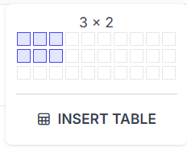
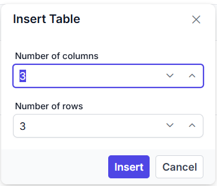
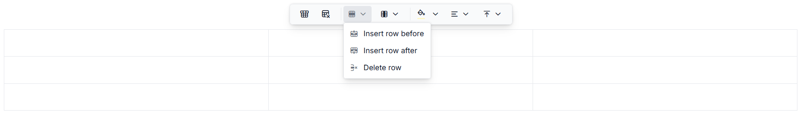
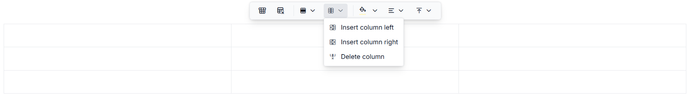
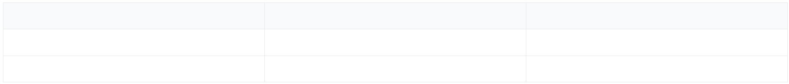
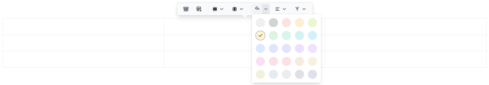
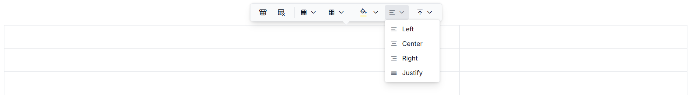
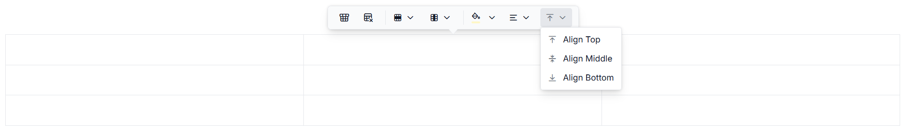

# Table Configuration & Properties

## Overview

The Modern Rich Text Editor provides comprehensive table functionality that allows users to create, edit, and format tables within editor content. Tables can be inserted through multiple methods, and offer extensive configuration options for rows, columns, headers, cell formatting, and alignment. This reference document describes all supported table actions and configurable properties.

## Supported Actions

### Table Insertion

#### Insert Table (Toolbar & Slash Command)
Insert a new table into the editor content.

**Access Methods:**
- Toolbar button: **Table**
- Slash command: **/table**
- Keyboard shortcut: **Ctrl+Shift+E**

**Interactive Table Popup Grid:**
- Displays a **3×10 grid** for quick table selection
- Hover over cells to preview table dimensions (e.g., "3 x 2")
- Click to insert table with selected rows and columns
- Includes "Insert Table" button to open detailed dialog

.

**Insert Table Dialog:**
- Allows custom specification of rows and columns
- Row range: 1–100
- Column range: 1–50
- Optional header row configuration

The following screenshot shows the table insert dialog

.

### Row Operations

The following screenshot shows the available options of the row item.



#### Insert Row Before
Insert a new row above the current row in the table.

Access via Quick Toolbar → **Row** dropdown menu.

#### Insert Row After
Insert a new row below the current row in the table.

Access via Quick Toolbar → **Row** dropdown menu.

#### Delete Row
Remove the current row from the table.

Access via Quick Toolbar → **Row** dropdown menu.

### Column Operations

The following screenshot shows the available options of the column item.



#### Insert Column Before
Insert a new column to the left of the current column.

Access via Quick Toolbar → **Column** dropdown menu.

#### Insert Column After
Insert a new column to the right of the current column.

Access via Quick Toolbar → **Column** dropdown menu.

#### Delete Column
Remove the current column from the table.

Access via Quick Toolbar → **Column** dropdown menu.

### Header Management

The following image illustrates the table header.



#### Toggle Header Row
Enable or disable the table header row, which applies distinct formatting to the first row.

Access via Quick Toolbar → **Header** button.

### Cell Formatting

#### Cell Background Color
Set or modify the background color of selected table cells.

Access via Quick Toolbar → **CellBackgroundColor** (color picker).



#### Horizontal Alignment
Set the text alignment within cells: **Left**, **Center**, **Right**, or **Justify**.

Access via Quick Toolbar → **Align** dropdown menu.



#### Vertical Alignment
Set the vertical alignment of cell content: **Top**, **Middle**, or **Bottom**.

Access via Quick Toolbar → **VerticalAlign** dropdown menu.



### Table Deletion

#### Delete Table
Remove the entire table from the editor content.

Access via Quick Toolbar → **Remove** button.

## Properties

### TableSettings

Use the [`tableSettings`](https://ej2.syncfusion.com/documentation/api/richtexteditor-ui/tableSettings) property to configure the default behavior and interaction settings in the Modern Rich Text Editor.

**Available Properties**

| Property | Type | Default | Description |
|----------|------|---------|-------------|
| `resize` | `boolean` | `true` | Enables or disables table resize drag handles.|

**React Configuration Example:**
```ts
<RichTextEditorUIComponent
  tableSettings={{
    resize: true
  }}
/>
```

### Quick Toolbar Items

The Quick Toolbar appears when a table is selected, providing quick access to common table operations. Configure which items appear in the Quick Toolbar using the [`quickToolbarSettings`](https://ej2.syncfusion.com/documentation/api/richtexteditor-ui/quickToolbarSettings###table) property.

**Available Table Items:**
- `Header` — Toggle header row button
- `Row` — Dropdown menu (Insert Row Before, Insert Row After, Delete Row)
- `Column` — Dropdown menu (Insert Column Before, Insert Column After, Delete Column)
- `CellBackgroundColor` — Color picker for cell background
- `Align` — Dropdown for horizontal alignment (Left, Center, Right, Justify)
- `VerticalAlign` — Dropdown for vertical alignment (Top, Middle, Bottom)
- `Remove` — Delete table button

**Default Configuration:**
```ts
['Header', 'Remove', '|', 'Row', 'Column', '|', 'CellBackgroundColor', 'Align', 'VerticalAlign']
```

### Keyboard Shortcuts

Quick keyboard access for common table operations:

| Shortcut | Action |
|----------|--------|
| **Ctrl+Shift+E** | Open Insert Table popup/dialog |
| **Arrow Keys** | Navigate within table grid selector (when popup is open) |
| **Enter** | Insert table with selected dimensions (when popup is open) |
| **Escape** | Close table popup or dialog |

The following example demonstrates how to enable table support and perform common table operations such as inserting rows, columns, formatting cells, and managing table content in the Modern Rich Text Editor.


















