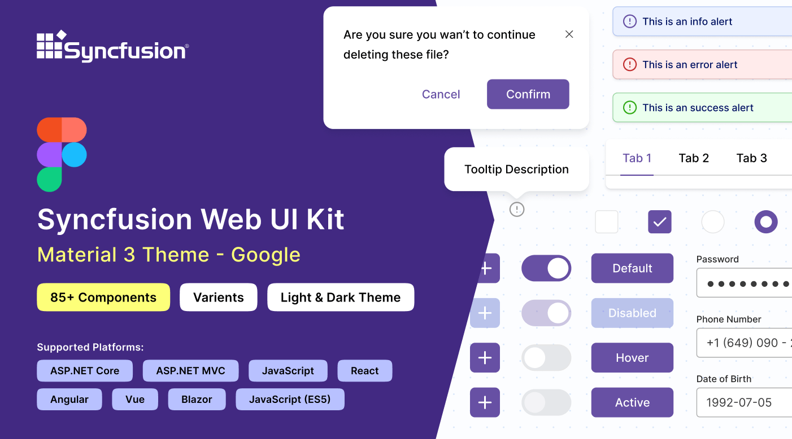
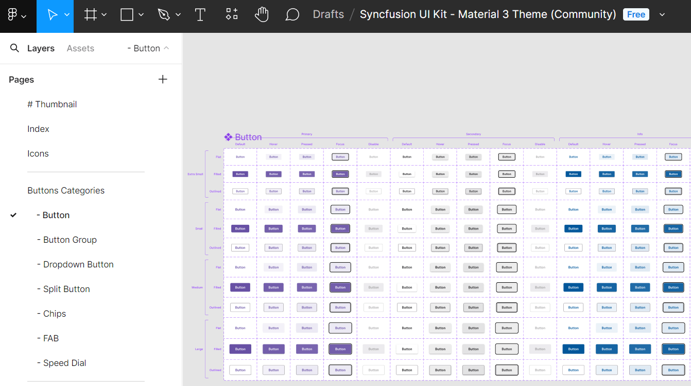
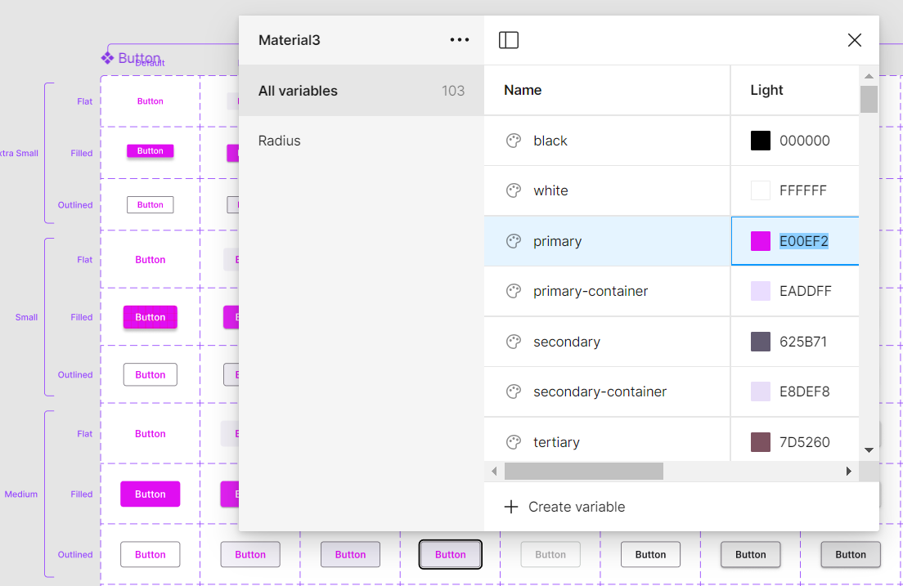
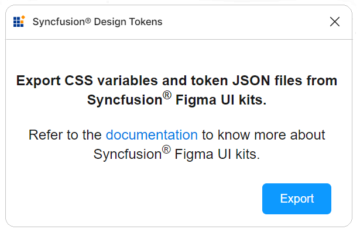

# Figma UI Kits

Syncfusion&reg; provides [Figma UI kits](https://www.figma.com/@syncfusion) that mirror the built-in themes of the React Rich Text Editor SDK — **Rich Text Editor**, **Block Editor**, and **Markdown Editor**. The kits let designers and developers collaborate on mockups that map one-to-one to the rendered React editors.

The Figma UI kits are available in four themes: [Material 3](https://www.figma.com/community/file/1454123774600129202/syncfusion-ui-kit-material-3-theme), [Fluent](https://www.figma.com/community/file/1385969120047188707/syncfusion-ui-kit-fluent-theme), [Tailwind](https://www.figma.com/community/file/1385969065626384098/syncfusion-ui-kit-tailwind-theme), and [Bootstrap 5](https://www.figma.com/community/file/1385968977953858272/syncfusion-ui-kit-bootstrap-5-theme). Each kit aligns with the matching built-in theme of the SDK.

## Advantages of the UI kits

- Comprehensive documentation of the React RTE-SDK editors, including states and variants for quick reference.
- Components are structured using [atomic design methodology](https://atomicdesign.bradfrost.com/chapter-2/), supporting simple and efficient customization.
- Developers can match the three editors exactly to project specifications.
- Standardized themes across the UI kit promote visual uniformity throughout projects.

## Download the UI kits

The kits are available through the [Figma community](https://www.figma.com/@syncfusion). Theme-specific kits include:

- [Material 3](https://www.figma.com/community/file/1454123774600129202/syncfusion-ui-kit-material-3-theme)
- [Fluent](https://www.figma.com/community/file/1385969120047188707/syncfusion-ui-kit-fluent-theme)
- [Tailwind](https://www.figma.com/community/file/1385969065626384098/syncfusion-ui-kit-tailwind-theme)
- [Bootstrap 5](https://www.figma.com/community/file/1385968977953858272/syncfusion-ui-kit-bootstrap-5-theme)

## Structure of the UI kits

Each kit is structured for easy navigation:

- **Thumbnail** — cover page for the UI kit.
- **Index** — comprehensive list of control names for fast navigation.
- **Icons** — dedicated collection of icons used across the designs.
- **UI Components** — main section displaying controls with figures, measurements, variants, and states.

## Customizing the UI kits

Modifications you make to a base component automatically propagate to its related instances and variants. For example, to change the primary button color in the Material 3 kit:

1. Open the [Material 3 kit](https://www.figma.com/community/file/1454123774600129202/syncfusion-ui-kit-material-3-theme) in the Figma web app by clicking **Open in Figma**.
2. Locate the button you wish to customize in the layout.
3. In the right panel, find the color variable (for example, `$primary-bg-color`) linked to the primary color variable.
4. Click **Local variables** to reveal the design tokens.
5. Use the color picker to select a new value. The style updates instantly across all related instances.

Further customizations are possible for fonts, spacing, shadows, and other properties. Adjust these design tokens to create a tailored design system.

## Exporting customized styles

Use the [Syncfusion Design Tokens](https://www.figma.com/community/plugin/1456992070400223733/syncfusion-design-tokens) Figma plugin to export your customized styles.

1. Open the Syncfusion Figma UI Kit in Figma.
2. Navigate to **Plugins & widgets**, search for **Syncfusion Design Tokens**, and run the plugin.
3. Click **Export** to create a ZIP file containing the design tokens.
4. Save and extract the ZIP file.

The exported ZIP typically contains:

- `css-variables.css` — CSS variables for both light and dark themes, generated from your customized Figma design. Import it into your application alongside the editor styles. See [CSS Variables](./css-variables) for integration steps.
- `<theme-name>-tokens.json` — style variables and values in JSON format. Import it into [Theme Studio](./theme-studio) for further refinement, then download the updated theme package and integrate it into your application.

## See also

* [Built-in Themes](./built-in-themes)
* [Theme Studio](./theme-studio)
* [CSS Variables](./css-variables)
