# Theme Studio

[Syncfusion<sup style="font-size:70%">&reg;</sup> Theme Studio](https://ej2.syncfusion.com/themestudio/) is an online tool that lets you customize the built-in Syncfusion themes for the React Rich Text Editor SDK — **Rich Text Editor**, **Block Editor**, and **Markdown Editor**. Adjust the primary color, typography, and other design tokens, then download a ready-to-use CSS file that contains the customized styles for the editor you render.

## Customizing a theme

1. Open [Theme Studio](https://ej2.syncfusion.com/themestudio/) and select a base theme (for example, Material 3, Fluent 2, Bootstrap 5.3, or Tailwind 3.4).

    The Theme Studio page is divided into two sections: a component preview on the left and the theme-customization section on the right.

    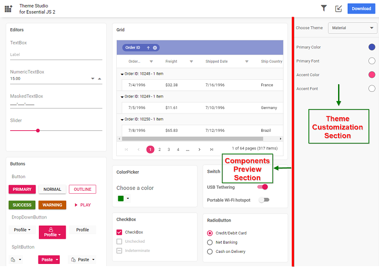

2. Click the color pickers in the customization section to select your desired colors.

    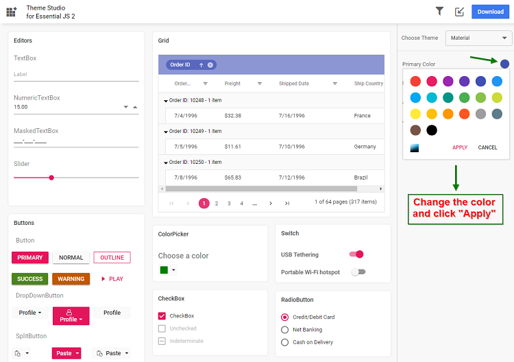

3. The components in the preview update automatically.

    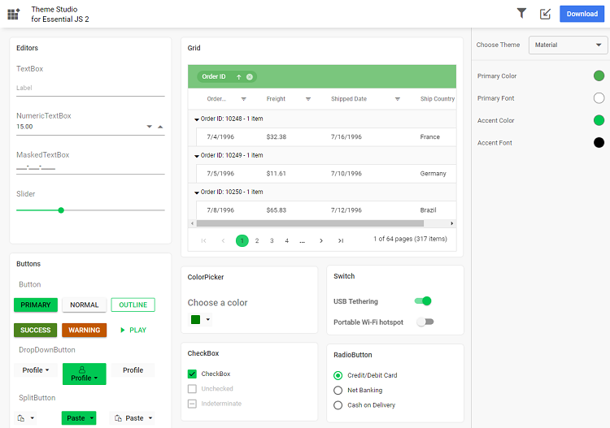

### Filter to a specific set of components

To reduce the final output size, filter the theme to only the editors you use:

1. Click the **Filter** icon and select the Rich Text Editor (and Block Editor / Markdown Editor if you use them).

    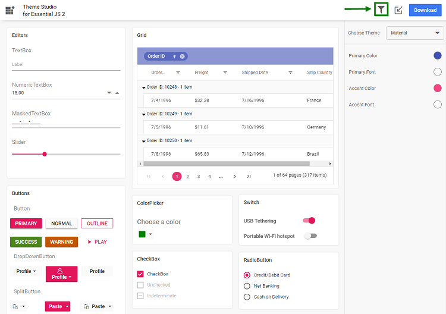

2. Click **Apply** — the preview shows only the selected components.

    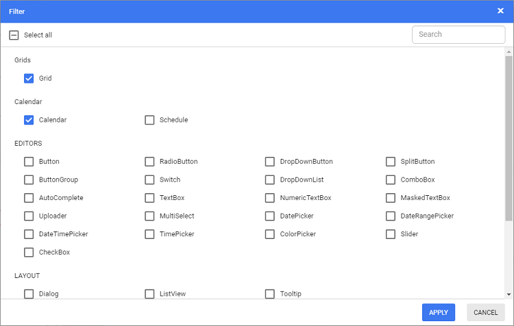

3. Customize the colors for the selected components.

    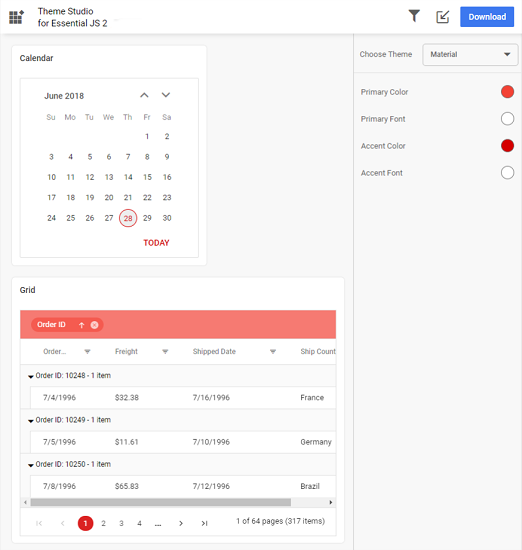

### Download the customized theme

1. Click the **Download** button.

    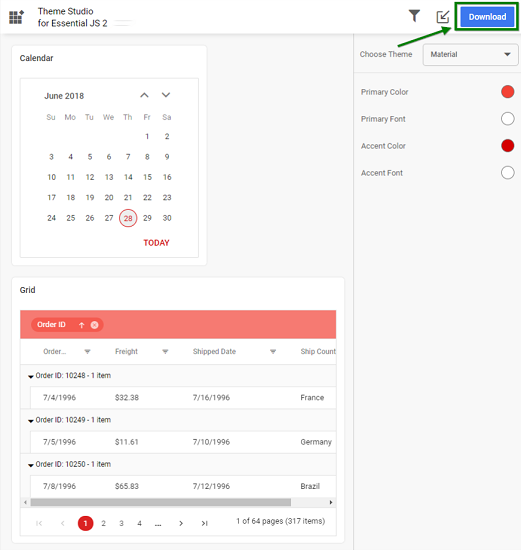

2. Optionally specify a custom file name, then click **Download**. If your application uses both Syncfusion Essential JS 1 and Essential JS 2 packages together, select **Include compatibility CSS** before downloading.

    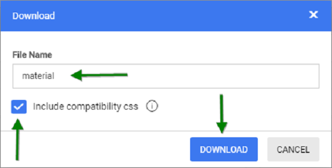

3. The downloaded ZIP file contains SCSS files, CSS files, and a `settings.json` file with the current Theme Studio settings.

    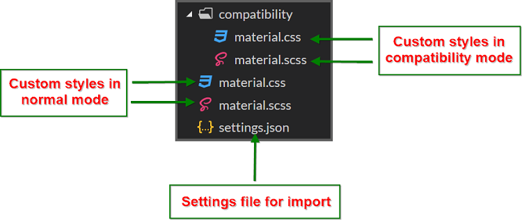

## Use the customized theme in your application

Copy the customized CSS file from the downloaded folder into your application (for example, `styles/custom-theme.css`) and reference it in the `<head>` section of your `index.html` or main layout file.

```html
<head>
  <link href="styles/custom-theme.css" rel="stylesheet" />
</head>
```

> If your application uses both EJ1 and EJ2 components, use the contents from the `compatibility` folder in the downloaded ZIP.

## Import previously changed settings

When you need to update your theme later, you can import the previously exported `settings.json` or `<theme-name>-tokens.json` file (from the [Figma Design Tokens plugin](./figma-ui-kits)) instead of starting from scratch.

1. Click the **Import** icon in the top-right corner of Theme Studio.

    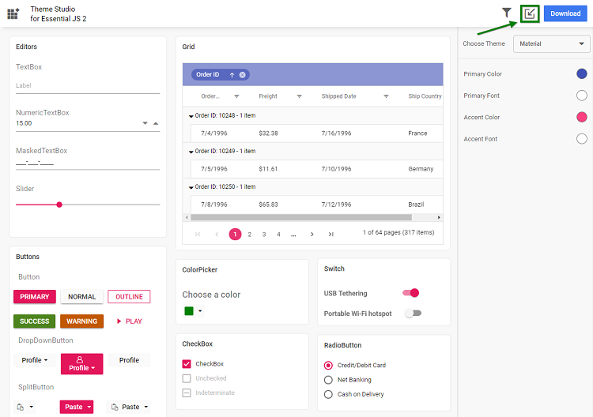

2. Click **Browse** and select your previously exported `settings.json` or `<theme-name>-tokens.json` file.

    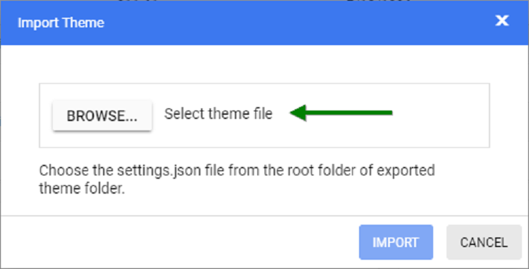

3. Click **Import**. The settings are applied.

    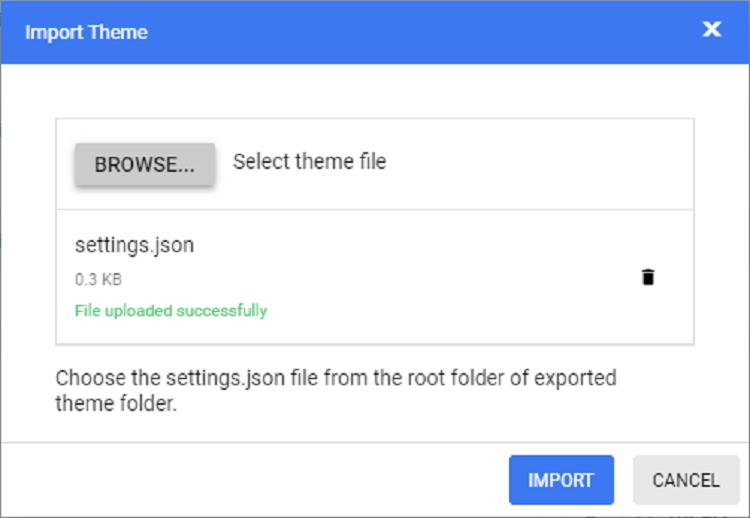

4. Modify the colors and re-download the theme. Replace the older custom style file in your application with the updated version.

## See also

* [Built-in Themes](./built-in-themes)
* [CSS Variables](./css-variables)
* [Migration to Theme Packages](./migration-to-theme-packages)
* [Figma UI Kits](./figma-ui-kits)
