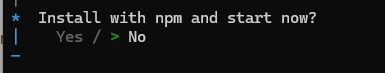

# Getting started in TypeScript Modern Rich Text Editor

The TypeScript Modern Rich Text Editor is a WYSIWYG component for creating, editing, and formatting rich text content. This section explains how to set up and use the Modern Rich Text Editor in a Vite-based TypeScript project.

## Prerequisites

This guide uses Vite as the bundler and development environment. Install Node.js `24.13.0` or `higher` before proceeding. For detailed information about Vite’s capabilities and configuration options, refer to the [Vite documentation](https://vite.dev).

## Create a TypeScript application

To set up a TypeScript application, run the following command.

```bash
npm create vite@latest my-app -- --template vanilla-ts
```

This command will prompt you to install the required packages and start the application. Select the options as shown below.



As Syncfusion packages are not installed yet, currently, the `No` option will be selected. Then, navigate to the project directory and install the dependencies using the following commands:

```bash
cd my-app
npm install
```

## Adding Modern Rich Text Editor packages

All the available Essential<sup style="font-size:70%">&reg;</sup> JS 2 packages are published in the [`npmjs.com`](https://www.npmjs.com/~syncfusionorg) public registry.
To install the Modern Rich Text Editor control, use the following command:

```bash
npm install @syncfusion/ej2-richtexteditor-ui
```

## Adding CSS reference

Syncfusion provides multiple themes for the Modern Rich Text Editor control. For a complete list of available themes, refer to the [themes packages](https://ej2.syncfusion.com/documentation/appearance/theme#theme-packages).

To apply the [Tailwind 3](https://www.npmjs.com/package/@syncfusion/ej2-tailwind3-theme) theme, install the corresponding theme package using the following command:

```bash
npm install @syncfusion/ej2-tailwind3-theme
```

The installed theme package includes an `index.css` file that automatically imports all the required dependency styles. Import the following stylesheet into `src/style.css`.

```css
@import '../node_modules/@syncfusion/ej2-tailwind3-theme/styles/rich-text-editor-ui/index.css';
```

I> To apply the application-specific styles correctly, import **style.css** into **src/main.ts** and remove all the default styles from **src/style.css** and use the Modern Rich Text Editor styles provided above.

## Adding Modern Rich Text Editor control

Now, you can start adding the Modern Rich Text Editor control to the application. For getting started, add the Modern Rich Text Editor initialization code in the **src/main.ts** file and add the target element in the **index.html** file using the following sample.




import { RichTextEditorUI } from '@syncfusion/ej2-richtexteditor-ui';

const editor: RichTextEditorUI = new RichTextEditorUI({
    placeholder: 'Type something ...'
});

editor.appendTo('#editor');





@import '../node_modules/@syncfusion/ej2-tailwind3-theme/styles/rich-text-editor-ui/index.css';




<!doctype html>
<html lang="en">

<head>
  <meta charset="UTF-8" />
  <link rel="icon" type="image/svg+xml" href="/vite.svg" />
  <meta name="viewport" content="width=device-width, initial-scale=1.0" />
  <title>Syncfusion TypeScript Modern Rich Text Editor</title>
</head>

<body>
  <div id="editor"></div>
  <script type="module" src="/src/main.ts"></script>
</body>

</html>



          
## Run the Application

Use the following command to run the application in the browser.

```bash
npm run dev
```

The Syncfusion<sup style="font-size:70%">&reg;</sup> TypeScript Modern Rich Text Editor is displayed in the browser as shown below.

