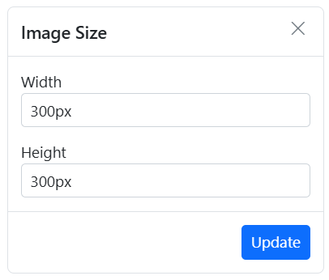

# Insert Images in React Rich Text Editor

Rich Text Editor allows to insert images in your content from online sources as well as local computer. For inserting an image to the Rich Text Editor, the following list of options have been provided in the [insertImageSettings](https://ej2.syncfusion.com/vue/documentation/api/rich-text-editor/imagesettingsmodel)

## Configuring image tool in the toolbar

You can add an `Image` tool in the Rich Text Editor toolbar using the `toolbarSettings` [items](https://ej2.syncfusion.com/vue/documentation/api/rich-text-editor/toolbarsettings#items) property.

> To use Image feature, inject `Image` in the provider section.

To configure the `Image` toolbar item, refer to the below code.









        


## Supported image save formats

The images can be saved as `Blob` or `Base64` URL by using the [insertImageSettings.saveFormat](https://ej2.syncfusion.com/vue/documentation/api/rich-text-editor/imagesettingsmodel#saveformat) property, which is of enum type, and the generated URL will be set to the `src` attribute of the `<source>` tag.

```HTML


```

The code snippet below illustrates the configuration of the [insertImageSettings.saveFormat](https://ej2.syncfusion.com/vue/documentation/api/rich-text-editor/imagesettingsmodel#saveformat) property in the Rich Text Editor.









        


> The default `saveFormat` property is set to `Blob` format.

## Inserting images from web URLs

To insert an image from an online source, click the `Image` tool in the toolbar. By default, this tool opens a dialog box with an input field where you can provide the image URL from the web to insert the image.

## Uploading images from local machine

To insert an image from your local machine, click the `Image` tool in the toolbar. By default, this tool opens a dialog box where you can browse and select an image to insert from your local machine.

## File manager integration for image insertion

To insert images from a file manager, enable the `FileManager` tool on the editor's toolbar. This tool initiates a dialog where you can upload new images and choose from existing ones, facilitating smooth image insertion into your content.

To integrate the file manager into the Rich Text Editor, follow these steps:

* Configure the `FileManager` toolbar item in the `toolbarSettings` API `items` property.
* Set the [enable](https://ej2.syncfusion.com/vue/documentation/api/rich-text-editor/filemanagersettings#enable) property to `true` in the [fileManagerSettings](https://ej2.syncfusion.com/vue/documentation/api/rich-text-editor/index-default#fileManagerSettings) property to ensure the file browser appears upon clicking the `FileManager` toolbar item.

> Rich Text Editor features are segregated into individual feature-wise modules. To use the file browser tool, configure `FileManager` in providers.

## Maximum file size restriction

You can restrict the image uploaded from the local machine when the uploaded image file size is greater than the allowed size by using the [maxFileSize](https://ej2.syncfusion.com/vue/documentation/api/rich-text-editor/imagesettingsmodel#maxfilesize) property. By default, the maximum file size is 30000000 bytes. You can configure this size as follows.

In the following example, the Image size has been validated before uploading and determined whether the Image has been uploaded or not.

```
<template>
    <div>
        <div class="control-section">
            <div class="sample-container">
                <div class="default-section">
                    <ejs-richtexteditor ref="rteObj" :height="340" :insertImageSettings="insertImageSettings"
                        :toolbarSettings="toolbarSettings">
                    </ejs-richtexteditor>
                </div>
            </div>
        </div>
    </div>
</template>

<script setup>
import { provide } from 'vue';
import { RichTextEditorComponent as EjsRichtexteditor,Toolbar, Link, Image, QuickToolbar, HtmlEditor, Table, PasteCleanup } from "@syncfusion/ej2-vue-richtexteditor";

const toolbarSettings = {
    items: ['Image', 'Bold', 'Italic', 'Underline', '|', 'Formats', 'Alignments', 'Blockquote', 'OrderedList', 'UnorderedList', '|', 'CreateLink', 'CreateTable', '|', 'SourceCode', '|', 'Undo', 'Redo']
};
const insertImageSettings = {
    maxFileSize: 30000000
};
provide('richtexteditor', [Toolbar, Link, Image, QuickToolbar, HtmlEditor, Table, PasteCleanup]);
</script>

<style> 
@import '../node_modules/@syncfusion/ej2-base/styles/material.css';
@import '../node_modules/@syncfusion/ej2-buttons/styles/material.css';  
@import '../node_modules/@syncfusion/ej2-calendars/styles/material.css';  
@import '../node_modules/@syncfusion/ej2-dropdowns/styles/material.css';  
@import '../node_modules/@syncfusion/ej2-inputs/styles/material.css';
@import '../node_modules/@syncfusion/ej2-navigations/styles/material.css';
@import '../node_modules/@syncfusion/ej2-lists/styles/material.css';
@import '../node_modules/@syncfusion/ej2-layouts/styles/material.css';
@import '../node_modules/@syncfusion/ej2-popups/styles/material.css';
@import '../node_modules/@syncfusion/ej2-splitbuttons/styles/material.css';
@import '../node_modules/@syncfusion/ej2-richtexteditor/styles/material.css';
</style>

```

## Saving images to server

Upload the selected image to a specified destination using the controller action specified in [insertImageSettings.saveUrl](https://ej2.syncfusion.com/vue/documentation/api/rich-text-editor/imagesettingsmodel#saveurl). Ensure to map this method name appropriately and provide the required destination path through the [insertImageSettings.path](https://ej2.syncfusion.com/vue/documentation/api/rich-text-editor/imagesettingsmodel#path) properties.

Configure [insertImageSettings.removeUrl](https://ej2.syncfusion.com/vue/documentation/api/rich-text-editor/imagesettingsmodel#removeurl) to point to the endpoint responsible for deleting image files.

Set the [insertImageSettings.saveFormat](https://ej2.syncfusion.com/vue/documentation/api/rich-text-editor/imagesettingsmodel#saveformat) property to determine whether the image should be saved as Blob or Base64, aligning with your application's requirements.










```csharp

public class HomeController : Controller
    {
        private IHostingEnvironment hostingEnv;

        public HomeController(IHostingEnvironment env)
        {
            hostingEnv = env;
        }

        public IActionResult Index()
        {
            return View();
        }

        [AcceptVerbs("Post")]
        public void SaveImage(IList<IFormFile> UploadFiles)
        {
            try
            {
                foreach (IFormFile file in UploadFiles)
                {
                    if (UploadFiles != null)
                    {
                        string filename = ContentDispositionHeaderValue.Parse(file.ContentDisposition).FileName.Trim('"');
                        filename = hostingEnv.WebRootPath + "\\Uploads" + $@"\{filename}";

                        // Create a new directory, if it does not exists
                        if (!Directory.Exists(hostingEnv.WebRootPath + "\\Uploads"))
                        {
                            Directory.CreateDirectory(hostingEnv.WebRootPath + "\\Uploads");
                        }

                        if (!System.IO.File.Exists(filename))
                        {
                            using (FileStream fs = System.IO.File.Create(filename))
                            {
                                file.CopyTo(fs);
                                fs.Flush();
                            }
                            Response.StatusCode = 200;
                        }
                    }
                }
            }
            catch (Exception)
            {
                Response.StatusCode = 204;
            }
        }

        [ResponseCache(Duration = 0, Location = ResponseCacheLocation.None, NoStore = true)]
        public IActionResult Error()
        {
            return View(new ErrorViewModel { RequestId = Activity.Current?.Id ?? HttpContext.TraceIdentifier });
        }
    }

```

### Rename images before inserting

You can use the [insertImageSettings](https://ej2.syncfusion.com/vue/documentation/api/rich-text-editor/index-default#insertimagesettings) property, to specify the server handler to upload the selected image. Then by binding the [imageUploadSuccess](https://ej2.syncfusion.com/vue/documentation/api/rich-text-editor/index-default#imageuploadsuccess) event, you can receive the modified file name from the server and update it in the Rich Text Editor's insert image dialog.

Refer the section [Rename images before inserting it in Rich Text Editor](../how-to/tailwind-preflight) for code snippets and examples.

### Secure image upload with authentication

You can add additional data with the image uploaded from the Rich Text Editor on the client side, which can even be received on the server side. By using the [imageUploading](https://ej2.syncfusion.com/vue/documentation/api/rich-text-editor/index-default#imageuploading) event and it's arguments you can access the current request and set the request header within these event. On the server side, you can fetch the custom headers by accessing the form collection from the current request, which retrieves the values sent using the POST method.

> By default, it doesn't support the `UseDefaultCredentials` property, you can manually append the default credentials with the upload request.










```csharp

public void SaveFiles(IList<IFormFile> UploadFiles)
{
    string currentPath = Request.Form["Authorization"].ToString();
}

```

## Image replacement functionality

Once a image file has been inserted, you can replace it using the Rich Text Editor [quickToolbarSettings](https://ej2.syncfusion.com/vue/documentation/api/rich-text-editor/quicktoolbarsettings#quicktoolbarsettings) `imageReplace` option. You can replace the image file either by using the web URL or the browse option in the image dialog.

## Deleting image

To remove an image from the Rich Text Editor content, select the image and click `Remove` tool from the quick toolbar. It will delete the image from the Rich Text Editor content as well as from the service location if the `removeUrl` is given.

Once you select the image from the local machine, the URL for the image will be generate. From there, you can remove the image from the service location by clicking the cross icon.


The following sample explains, how to configure the `removeUrl` to remove a saved image from the remote service location, when the image is removed using the Insert Image dialog.









        


## Deleting Images from Server Using Keyboard and Quick Toolbar Actions

In the Rich Text Editor, deleting images using the `Delete` or `Backspace` keys, or the Quick Toolbar's `Remove` button, removes the image from the editor content not from the server.

This behavior is intentional, allowing undo/redo operations to function properly without breaking references to previously uploaded images.

To explicitly remove images from the server, use the `afterImageDelete` event. This event is triggered after an image is removed from the content and provides the src URL of the image, which can be used to initiate a request to your server for deleting the corresponding file.

The following sample demonstrates how to use the afterImageDelete event in Rich Text Editor to delete images from the server after they are removed from the editor content:

```
<template>
    <div>
        <div class="control-section">
            <div class="sample-container">
                <div class="default-section">
                    <ejs-richtexteditor ref="rteObj" :insertImageSettings="insertImageSettings" :value="rteValue" :afterImageDelete="afterImageDeleteHandler" :toolbarSettings="toolbarSettings"></ejs-richtexteditor>
                </div>
            </div>
        </div>
    </div>
</template>

<script>
import { RichTextEditorComponent, Toolbar, Link, Image, HtmlEditor } from "@syncfusion/ej2-vue-richtexteditor";
export default {
    name: "App",
    components: {
        "ejs-richtexteditor": RichTextEditorComponent
    },
    data: function () {
        return {
            toolbarSettings: {
                items: ['Image']
            },
            insertImageSettings : {
                saveUrl: "[SERVICE_HOSTED_PATH]/api/Home/SaveImage",
                path: "[SERVICE_HOSTED_PATH]/Uploads/"
            },
            rteValue: `<p>The Syncfudion Rich Text Editor, a WYSIWYG (what you see is what you get) editor, is a user interface that allows you to create, edit, and format rich text content. You can try out a demo of this editor here.</p><p><b>Key features:</b></p><ul><li><p>Provides &lt;IFRAME&gt; and &lt;DIV&gt; modes.</p></li><li><p>Bulleted and numbered lists.</p></li><li><p>Handles images, hyperlinks, videos, hyperlinks, uploads, etc.</p></li><li><p>Contains undo/redo manager. </p></li></ul><div style='display: inline-block; width: 60%; vertical-align: top; cursor: auto;'></div>`,
        };
    },  
    methods: {
        afterImageDeleteHandler(args) {
            if (args && args.src) {
                const src = args.src;
                const fileName = src.split('/').pop();
                const dummyFile = new File([''], fileName);
                const formData = new FormData();
                formData.append('UploadFiles', dummyFile);
                fetch(this.insertImageSettings.removeUrl, {
                method: 'POST',
                body: formData,
                })
                .then((response) => {
                    if (!response.ok) throw new Error('Server responded with an error');
                    console.log('Image deleted successfully:', fileName);
                })
                .catch((error) => {
                    console.error('Image deletion failed:', error);
                });
            }
        },
    },
    provide: {
        richtexteditor: [Toolbar, Link, Image, HtmlEditor]
    }
}
</script>

<style>
@import "../../node_modules/@syncfusion/ej2-base/styles/material.css";
@import "../../node_modules/@syncfusion/ej2-inputs/styles/material.css";
@import "../../node_modules/@syncfusion/ej2-lists/styles/material.css";
@import "../../node_modules/@syncfusion/ej2-popups/styles/material.css";
@import "../../node_modules/@syncfusion/ej2-buttons/styles/material.css";
@import "../../node_modules/@syncfusion/ej2-navigations/styles/material.css";
@import "../../node_modules/@syncfusion/ej2-splitbuttons/styles/material.css";
@import "../../node_modules/@syncfusion/ej2-vue-richtexteditor/styles/material.css";
</style>

```

## Adjusting image dimensions

Sets the default width and height of the image when it is inserted in the Rich Text Editor using [width](https://ej2.syncfusion.com/vue/documentation/api/rich-text-editor/imagesettingsmodel#width) and [height](https://ej2.syncfusion.com/vue/documentation/api/rich-text-editor/imagesettingsmodel#height) of the [insertImageSettings](https://ej2.syncfusion.com/vue/documentation/api/rich-text-editor/imagesettingsmodel) property.

Through the quick toolbar, change the width and height using `Change Size` option. Once you click, the Image Size dialog box will open as follows. In that you can specify the width and height of the image in pixel.



## Adding captions and Alt text

Image caption and alternative text can be specified for the inserted image in the Rich Text Editor through the [quickToolbarSettings](https://ej2.syncfusion.com/vue/documentation/api/rich-text-editor/index-default#quickToolbarSettings) property. It has following two options,

* Image Caption
* Alternative Text.

Selecting `Image Caption` wraps the image in a caption container where you can enter caption text directly within the editor. When the caption option is toggled, any caption text you have added is preserved so you can continue editing without losing content.

The `Alternative Text` option lets you provide descriptive text that appears when an image cannot be displayed in the Rich Text Editor.

## Configuring image display position

Sets the default display for an image when it is inserted in the Rich Text Editor using [display](https://ej2.syncfusion.com/vue/documentation/api/rich-text-editor/imagesettingsmodel#display) field in [insertImageSettings](https://ej2.syncfusion.com/vue/documentation/api/rich-text-editor/imagesettingsmodel). It has two possible options: 'inline' and 'block'.









        


## Configuring image alignment

Images in the Rich Text Editor can be aligned using the alignment options in the image quick toolbar. To enable alignment, the `Align` item needs to be added to the image `quickToolbarSettings`. When an alignment option is applied, the editor sets the image's `display` style to `block`. This allows the image to behave as a block-level element within the content layout and align based on the selected option (`left`, `center`, or `right`).












## Text wrapping around images

The Rich Text Editor provides control over how text flows around images using the `WrapText` options available in the image quick toolbar. To enable these options, the `WrapText` item needs to be added to the image `quickToolbarSettings`. The `WrapText` item provides options to float an image to the `left` or `right`, letting adjacent text flow alongside the image for more compact and flexible layouts.












## Hyperlinking images

The hyperlink itself can be an image in Rich Text Editor. If the image given as hyperlink, remove, edit and open link will be added to the quick toolbar of image. For further details about link, see the [`link documentation`](./link) documentation.


## Image resizing

Rich Text Editor has a built-in image inserting support.  The resize points will be appearing on each corner of image when focus. So, users can resize the image using mouse points or thumb through the resize points easily. Also, the resize calculation will be done based on aspect ratio.


## Configuring allowed image types

You can allow the specific images alone to be uploaded using the the allowedTypes property. By default, the Rich Text Editor allows the JPG, JPEG, and PNG formats. You can configure this formats as follows.

```ts

    insertImageSettings: {
      allowedTypes: ['.jpg', '.png', '.jpeg']
    }

```
## Paste images into the editor

The Rich Text Editor supports pasting images directly into the editor content. You can paste single or multiple images from your file system directly into the editor.

## Drag and drop image insertion

By default, the Rich Text Editor allows you to insert images by drag-and-drop from the local file system such as Windows Explorer into the content editor area. And, you can upload the images to the server before inserting into the editor by configuring the saveUrl property. The images can be repositioned anywhere within the editor area by dragging and dropping the image.

In the following sample, you can see feature demo.









        


### Disabling image drag and drop

You can prevent drag-and-drop action by setting the actionBegin argument cancel value to true. The following code shows how to prevent the drag-and-drop.

``` typescript

    actionBegin: function (args) {
        if(args.type === 'drop' || args.tpe === 'dragstart') {
            args.cancel =true;
        }
    }

```

## See also

* [Image Quick Toolbar](../toolbar/quick-toolbar#customizing-the-image-quick-toolbar)
* [Hyperlink Management](https://ej2.syncfusion.com/vue/documentation/rich-text-editor/link)