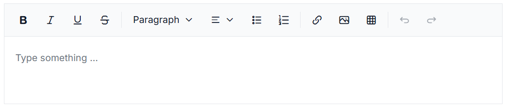

# Getting Started with Vue Modern Rich Text Editor

The Vue Modern Rich Text Editor is a WYSIWYG component for creating, editing, and formatting rich text content. This guide explains how to integrate it into a Vue application using Vite and TypeScript.





## Prerequisites

- [Node.js 24+](https://nodejs.org/en) (LTS recommended).
- Syncfusion CLI.

## Install the Syncfusion CLI 

Install the Syncfusion CLI globally using the following command:



npm install -g @syncfusion/syncfusion-cli



## Set up the Vite project using Syncfusion CLI

You can create a Vue application with [Vite](https://vite.dev/) using the Syncfusion CLI. The CLI provides two ways to create a project:

### Non-interactive mode

Non-interactive mode allows you to create a project directly using a single command with the required command-line arguments.



sf new my-app --framework vue --type ts --template rich-text-editor-ui --theme tailwind3



In this mode, the project configuration is passed directly in the command. The above command creates a `Vue` application with Vite and configured it with the Syncfusion<sup style="font-size:70%">&reg;</sup> `Modern Rich Text Editor` component. The generated project uses the TypeScript and the Composition API.

### Interactive mode

Interactive mode guides you through the project creation process with step-by-step prompts.



sf



When you run the `sf` command, the CLI prompts you to select the required project configuration options. To create a Vue application with Vite and the Syncfusion<sup style="font-size:70%">&reg;</sup> `Modern Rich Text Editor` component, select the following options:




√ Project name? ... my-app
√ Choose Framework: » Vue
√ Choose Language: » TypeScript
√ Choose Template: » Rich Text Editor UI
√ Choose Theme: » Tailwind3
√ Choose Style Format: » CSS
√ Would you like to integrate the Syncfusion MCP Server (AI Assistant) into this project? ... no
√ Would you like to install Syncfusion Component Skills for AI-powered development? ... no      
√ Install dependencies and start app now? ... no




The above selections generate a `Vue` application with Vite and configure it with the Syncfusion<sup style="font-size:70%">&reg;</sup> `Modern Rich Text Editor` component. You can choose different values for language, theme, style format, MCP setup, and skills installation based on your project requirements.

The Syncfusion<sup style="font-size:70%">&reg;</sup> CLI creates the project with a predefined template. After the project is generated, you can customize or replace the component code based on your application requirements.

## Run the project

Once the project is created, navigate to the project directory and run the following commands in your terminal.



cd my-app
npm install
npm run dev



The output will appear as follows:






## Prerequisites

This guide uses Vite as the bundler and development environment. Install Node.js `24.13.0` or `higher` before proceeding. For detailed information about Vite’s capabilities and configuration options, refer to the [Vite documentation](https://vitejs.dev/).

N> For information about supported Vue versions and Syncfusion package compatibility, refer to the [Version Compatibility](https://ej2.syncfusion.com/vue/documentation/upgrade/version-compatibility) documentation.

## Create a Vue Application

To set up a Vue application, run the following command.

```bash
npm create vite@latest my-app -- --template vue-ts
```
This command will prompt you to install the required packages and start the application. Select the options as shown below.


Since the Syncfusion packages are not installed at this stage, choose the `No` option when prompted. Then, navigate to the project directory and install the dependencies using the following commands:

```bash
cd my-app
npm install
```

## Adding Syncfusion Modern Rich Text Editor package

All available Essential JS 2 packages are published in the [npmjs.com](https://www.npmjs.com/search?q=ej2-vue) registry. Install the Vue Modern Rich Text Editor component with the following command:

```bash
npm install @syncfusion/ej2-vue-richtexteditor-ui
```

## Adding CSS reference

Syncfusion provides multiple themes for the Modern Rich Text Editor component. For a complete list of available themes, refer to the [themes packages](https://ej2.syncfusion.com/vue/documentation/appearance/theme#theme-packages). 

To apply the [Tailwind 3](https://www.npmjs.com/package/@syncfusion/ej2-tailwind3-theme) theme, install the corresponding theme package by using the following command:

```bash
npm install @syncfusion/ej2-tailwind3-theme
```

The installed theme package includes an `index.css` file that automatically imports all the required dependency styles. Import the following stylesheet into `src/style.css`.

```css
@import '../node_modules/@syncfusion/ej2-tailwind3-theme/styles/rich-text-editor-ui/index.css';
```

I> To apply the application-specific styles correctly remove all the default styles from **src/style.css**. 

## Adding Modern Rich Text Editor component

Now, you can start adding the Vue Modern Rich Text Editor component in the application. For getting started, add the Modern Rich Text Editor component in **src/App.vue** file using the following sample.










## Run the Application

Use the following command to run the application in the browser.

```bash
npm run dev
```

The Syncfusion<sup style="font-size:70%">&reg;</sup> Vue Modern Rich Text Editor is displayed in the browser as shown below.





